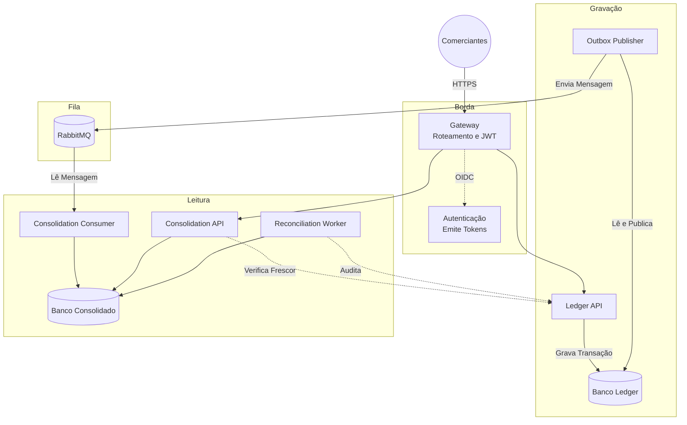

# Fluxo de Caixa para Comerciantes

Boas vindas ao sistema de controle de fluxo de caixa para comerciantes. Aqui, construímos um motor financeiro assíncrono e resiliente. O objetivo principal é muito claro: registrar débitos e créditos com total segurança e garantir que o comerciante consiga ver seu saldo consolidado diário. E o mais importante: se a leitura do saldo cair, a gravação de novos lançamentos nunca pode ser afetada.

Toda a arquitetura, as decisões técnicas e os diagramas estão na pasta `docs/`. Abaixo, você encontra o guia completo de como o projeto funciona e como rodar tudo na sua própria máquina.

## O Problema que Resolvemos

Muitos sistemas financeiros antigos sofrem quando precisam calcular o saldo de milhares de lançamentos em tempo real. Eles travam o banco de dados e os clientes recebem mensagens de erro (timeouts). Nós resolvemos isso separando o problema em dois mundos:

1. **O Mundo da Gravação (Ledger API):** Recebe o registro de um débito ou crédito e salva imediatamente. Ele não calcula saldos nem espera nada. Apenas carimba que a transação aconteceu.
2. **O Mundo da Leitura (Consolidation API):** Lê as transações que aconteceram no Ledger de forma assíncrona (usando filas RabbitMQ) e vai atualizando o saldo aos poucos. Quando o usuário pede para ver o saldo diário, a Consolidation API só consulta o valor pronto, retornando em milissegundos.

## Como Tudo Funciona

A arquitetura usa o padrão CQRS e Outbox Pattern. Veja como os componentes se conversam:



## Pré-requisitos

Para rodar este projeto localmente, você vai precisar de:
* Go 1.26.5
* Docker e Docker Compose (para subir a infraestrutura local)
* Opcional: GNU Make (fortemente recomendado para usar os atalhos)

As ferramentas de compilação de Protobuf e linters são baixadas automaticamente na pasta `.tools/bin` pelo comando de bootstrap. Você não precisa instalar nada globalmente.

## Como Rodar Localmente

É muito simples subir todo o ecossistema na sua máquina. Siga os passos:

1. **Baixe as ferramentas e prepare o código:**
```sh
make bootstrap
```

2. **Gere os segredos e certificados locais:**
```sh
go run scripts/generate-compose-secrets.go
```

3. **Suba toda a infraestrutura com Docker Compose:**
```sh
docker-compose up -d --build
```

Isso vai iniciar os bancos de dados PostgreSQL isolados, o RabbitMQ, o Keycloak para autenticação, o gateway KrakenD, as APIs de Ledger e Consolidation, além dos workers que conectam tudo debaixo do capô.

## Autenticação e Exemplos Práticos

A nossa porta de entrada é o gateway na porta 8080 (normalmente mapeado no `/etc/hosts` como `edge.cashflow.local`). Como a segurança é nativa, você precisa de um token JWT válido para fazer qualquer requisição.

Para simular e testar, preparamos testes comportamentais completos (BDD). Você pode visualizar todas as integrações funcionando perfeitamente rodando os cenários de teste E2E:

```sh
make integration
```

Este comando levanta contêineres temporários de teste, pega um token JWT real do Keycloak e simula dezenas de transações de crédito e débito, garantindo que o saldo bata perfeitamente no final.

## Testes e Evidências

Não escrevemos apenas testes unitários. Temos um catálogo completo de 81 cenários executáveis com a ferramenta Godog (nossa implementação de BDD em Go). 

Para rodar o pacote de validação inteiro da CI, que inclui testes de concorrência, linters de segurança e quebra de contratos (breaking changes), rode:

```sh
make ci
make full-validation
```

## Falhas Comuns e Solução de Problemas (Troubleshooting)

* **As portas já estão em uso:** O Docker Compose sobe serviços nas portas 8080, 5432, 5672, etc. Certifique se de não ter outro Postgres ou RabbitMQ rodando na sua máquina.
* **O make falha no mac:** Instale o `make` nativo através do Homebrew (`brew install make`).
* **Meu token está dando Unauthorized (401):** O Token tem vida útil curta. Gere um novo fazendo um POST para o endpoint `/realms/cashflow/protocol/openid-connect/token` no Keycloak.
* **O Saldo Consolidado não está atualizando:** Verifique se os contêineres `ledger-outbox-publisher` e `consolidation-consumer` estão rodando. Se eles pararem, as mensagens vão acumular no RabbitMQ e o saldo não vai refletir as transações recentes (mas nenhuma transação será perdida!).

## Documentação Extra

Gosta de saber os "por quês"? Nós também. Todos os diagramas, a tabela de mitigação de incidentes, a matriz de conformidade, e nossas Decisões de Arquitetura (ADRs) moram na pasta `docs/`. Sugerimos fortemente a leitura do arquivo `docs/arquitetura-alvo.md` para entender as escolhas difíceis e como blindamos este sistema para escalar sem medo.
