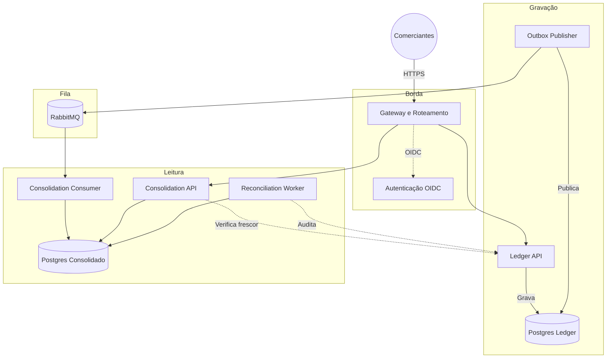

# Fluxo de Caixa para Comerciantes

Boas-vindas ao sistema de controle de fluxo de caixa para comerciantes. A ideia é construir um motor financeiro assíncrono e resiliente. O objetivo principal é muito claro: registrar débitos e créditos com segurança e garantir que o comerciante veja seu saldo diário. E o mais importante: se a leitura do saldo cair, a gravação de novos lançamentos nunca pode ser afetada.

Toda a arquitetura, decisões técnicas e diagramas estão documentados na pasta `docs/`. Abaixo explico como o projeto funciona e como executá-lo.

## Problema Identificado

Analisando o cenário, identificamos que processar grandes volumes de lançamentos no mesmo banco de dados responsável pelas consultas de saldo estava gerando lentidão e falhas. Nesse caso, a recomendação é separar a responsabilidade em duas partes:

1. **Gravação (Ledger API):** Apenas recebe o débito ou crédito e salva imediatamente. Não calcula saldos nem perde tempo.
2. **Leitura (Consolidation API):** Lê os lançamentos do Ledger de forma assíncrona (via RabbitMQ) e vai atualizando o saldo. Dessa forma, quando o usuário pede para ver o saldo diário, a API apenas devolve o valor pronto em milissegundos.

## Fluxo de Funcionamento

Foi definido o uso do padrão CQRS aliado ao Outbox Pattern. O fluxo irá funcionar da seguinte forma: primeiro a requisição chega no KrakenD e é validada. Em seguida, a Ledger API salva a transação no banco e na tabela outbox na mesma transação. Após isso, o serviço Publisher envia o evento pro RabbitMQ. Por fim, o Consumer pega a mensagem e atualiza o banco do Consolidado.



## Como Rodar Localmente

Para rodar o projeto, você vai precisar de Go 1.26.5, Docker e Docker Compose (e GNU Make).

### Caminho rápido (recomendado)

Um único comando cuida de tudo: instala as ferramentas, compila, gera os
certificados/segredos locais (se ainda não existirem) e sobe a stack inteira
(APIs, bancos, filas, identidade e o stack de observabilidade):

```sh
make up
```

Ao final ele imprime os endereços e credenciais de cada painel (Grafana,
Keycloak, Jaeger, Prometheus, RabbitMQ). Repetir `make up` depois de um `make
down` é rápido e seguro, os passos são incrementais e os certificados só
são gerados de novo se a pasta `secrets/` não existir.

```sh
make down      # para os containers, mantém os dados (volumes)
make destroy   # apaga containers, volumes e rede, recomeça do zero
```

### Passo a passo manual (o que o `make up` faz por baixo dos panos)

Se preferir rodar cada etapa você mesmo:

1. **Baixe as ferramentas e prepare o código:**
```sh
make bootstrap
```

2. **Gere os certificados locais:**
```sh
go run scripts/generate-compose-secrets.go
```

3. **Suba a infraestrutura completa:**
```sh
docker compose --profile app --profile observability up -d --build
```

Isso vai iniciar os bancos de dados, filas, identidade, as APIs e o stack de
monitoramento (Prometheus, Jaeger, Grafana). Se quiser subir só a aplicação,
sem observabilidade, omita `--profile observability`.

Para validar a integridade e os fluxos, rode os testes automatizados:
```sh
make integration
make smoke
```

Para testes de carga/stress via K6:
```sh
make load-test          # Roda passando pelo Gateway (Edge) simulando tráfego real
make load-test-backend  # Roda chamadas diretas às APIs isoladas do Gateway
```

### Estratégia de Teste de Carga e Concorrência Real (100 VUs)
Para garantir e comprovar que a arquitetura suporta escalabilidade e não possui gargalos estruturais, o script de teste de carga (`test/k6/load.js`) foi configurado para rodar um **estresse com 100 VUs (Usuários Virtuais) simultâneos**, exercitando as 5 rotas cruciais do sistema de forma paralela.

Para simular um **cenário realista de concorrência massiva**, dividimos a carga em 5 cenários isolados competindo ao mesmo tempo:
- `write_entries`: 40 VUs focados apenas em gerar lançamentos (`POST /v1/entries`), estressando a Ledger API, Postgres e RabbitMQ.
- `read_balances`: 20 VUs buscando o saldo consolidado (`GET /v1/daily-balances`), estressando a Consolidation API.
- `list_entries`: 20 VUs buscando extratos gerais (`GET /v1/entries`).
- `get_entry`: 10 VUs lendo um lançamento específico pelo ID (`GET /v1/entries/{entry_id}`).
- `reverse_entry`: 10 VUs tentando realizar o estorno de um lançamento de forma concorrente (`POST /v1/entries/{entry_id}/reversals`).

> **Nota de Avaliação (Rate Limits):** O KrakenD possui *rate limits* estritos. Para permitir que o gateway local aceite as rajadas do teste de carga sem bloqueios artificiais (HTTP 429), **os limites globais de requisições no `deploy/edge/krakend/krakend.json` foram majorados para 2.000**. Para testar cenários de bloqueio e resiliência, basta baixar esses números e aplicar a carga novamente.
## Acessos e Interfaces

Com a infraestrutura rodando, os painéis e ferramentas de controle ficam disponíveis localmente:

| Serviço | Acesso | Usuário Padrão | Senha Padrão |
| --- | --- | --- | --- |
| **Grafana** (Dashboards) | [http://localhost:3000](http://localhost:3000) | `admin` | `admin` |
| **Jaeger** (Traces OTel) | [http://localhost:16686](http://localhost:16686) | - | - |
| **Prometheus** (Métricas) | [http://localhost:9090](http://localhost:9090) | - | - |
| **RabbitMQ** (Mensageria) | [http://localhost:15672](http://localhost:15672) | `cashflow` | `secret` |
| **Keycloak** (Identidade) | [https://localhost:8443](https://localhost:8443) | `admin` | `admin` |
| **KrakenD** (API Gateway) | `http://localhost:8080` | - | - |

> **Aviso:** O Grafana já possui o dashboard principal provisionado automaticamente. Basta acessar para ver as métricas sendo populadas em tempo real.

## Autenticação e Integração

Analisando esse ponto de acesso, a segurança é nativa. Você precisa de um token JWT válido para fazer qualquer requisição.
O Keycloak já possui os usuários `merchant-a` e `merchant-b`.

Para obter um token de acesso:
```sh
TOKEN=$(curl -sk -X POST "https://localhost:8443/realms/cashflow/protocol/openid-connect/token" \
  -H "Host: edge.cashflow.local" \
  -d grant_type=password -d client_id=cashflow-merchant-app \
  -d username=merchant-a -d password=merchant-a-pass \
  -d scope="ledger:write ledger:read consolidation:read" \
  | python3 -c "import json,sys; print(json.load(sys.stdin)['access_token'])")
```

Para criar um lançamento (gravação):
```sh
curl -X POST http://localhost:8080/v1/entries \
  -H "Host: edge.cashflow.local" \
  -H "X-Forwarded-Proto: https" \
  -H "Authorization: Bearer $TOKEN" \
  -H "Content-Type: application/json" \
  -H "Idempotency-Key: $(python3 -c 'import uuid; print(uuid.uuid4())')" \
  -d '{"type":"ENTRY_TYPE_CREDIT","amount":"10.00","currency":"BRL","business_date":"2026-08-05","description":"venda"}'
```

Para consultar o saldo consolidado (leitura):
```sh
curl -X GET "http://localhost:8080/v1/daily-balances?start_date=2026-08-05&end_date=2026-08-05" \
  -H "Host: edge.cashflow.local" \
  -H "X-Forwarded-Proto: https" \
  -H "Authorization: Bearer $TOKEN"
```

## Riscos e Pontos de Atenção (Troubleshooting)

* **Portas Ocupadas:** o Docker expõe 5432 (Postgres), 5672/15672/15692 (RabbitMQ), 8080 (KrakenD), 8443 (Keycloak), 9090 (Prometheus), 16686/4317 (Jaeger) e 3000 (Grafana). Feche outros serviços locais se tiver conflitos.
* **Erro 401 Unauthorized:** O token tem duração curta ou você não enviou os `scopes` obrigatórios. Gere o token novamente garantindo a passagem do parâmetro `scope`.
* **Erros de SSL/TLS (Certificate Expired):** Os certificados locais têm validade curta. Limpe a pasta `secrets/certs`, rode novamente o `generate-compose-secrets.go` e reinicie os containers.
* **O Saldo Consolidado não está atualizando:** verifique se os contêineres `ledger-outbox-publisher` e `consolidation-consumer` não morreram, fazendo as mensagens travarem na fila.

## Documentação Técnica

Para se aprofundar nas decisões arquiteturais e nas evidências do sistema, consulte os arquivos abaixo:

| Documento | Descrição |
| --- | --- |
| [Legado e Arquitetura](docs/legado-e-arquitetura.md) | O sistema legado hipotético e seus incidentes, a arquitetura alvo e por quê, o plano de migração e a relação entre cada decisão e sua evidência. |
| [Estimativas Cloud](docs/custos/estimativas-cloud.md) | Projeção de custos e trade-offs para AWS, GCP e Azure. |
