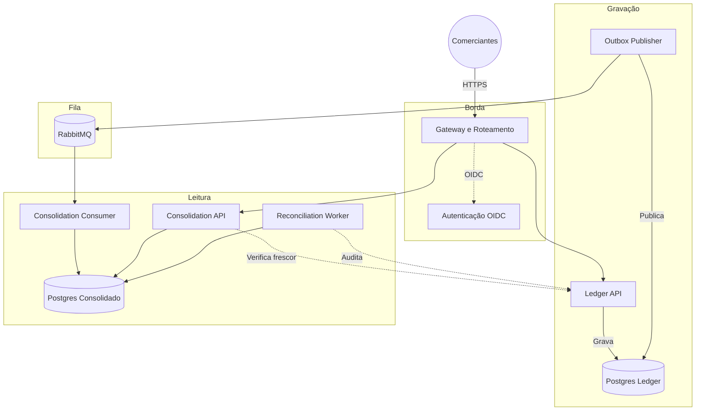

# Fluxo de Caixa para Comerciantes

Boas-vindas ao sistema de controle de fluxo de caixa para comerciantes. A ideia é construir um motor financeiro assíncrono e resiliente. O objetivo principal é muito claro: registrar débitos e créditos com segurança e garantir que o comerciante veja seu saldo diário. E o mais importante: se a leitura do saldo cair, a gravação de novos lançamentos nunca pode ser afetada.

Toda a arquitetura, decisões técnicas e diagramas estão documentados na pasta `docs/`. Abaixo explico como o projeto funciona e como executá-lo.

## Problema Identificado

Analisando o cenário, identificamos que processar grandes volumes de lançamentos no mesmo banco de dados responsável pelas consultas de saldo estava gerando lentidão e falhas. Nesse caso, a recomendação é separar a responsabilidade em duas partes:

1. **Gravação (Ledger API):** Apenas recebe o débito ou crédito e salva imediatamente. Não calcula saldos nem perde tempo.
2. **Leitura (Consolidation API):** Lê os lançamentos do Ledger de forma assíncrona (via RabbitMQ) e vai atualizando o saldo. Dessa forma, quando o usuário pede para ver o saldo diário, a API apenas devolve o valor pronto em milissegundos.

## Fluxo de Funcionamento

Foi definido o uso do padrão CQRS aliado ao Outbox Pattern. O fluxo irá funcionar da seguinte forma: primeiro a requisição chega no KrakenD e é validada. Em seguida, a Ledger API salva a transação no banco e na tabela outbox na mesma transação. Após isso, o serviço Publisher envia o evento pro RabbitMQ. Por fim, o Consumer pega a mensagem e atualiza o banco do Consolidado.



## Como Rodar Localmente

Para rodar o projeto, você vai precisar de Go 1.26.5, Docker e Docker Compose (e GNU Make).

1. **Baixe as ferramentas e prepare o código:**
```sh
make bootstrap
```

2. **Gere os certificados locais:**
```sh
go run scripts/generate-compose-secrets.go
```

3. **Suba a infraestrutura completa:**
```sh
docker-compose up -d --build
```

Isso vai iniciar os bancos de dados, filas, identidade e as APIs.
Para subir com o stack completo de monitoramento (Prometheus, Jaeger, Grafana):
```sh
docker compose --profile app --profile observability up -d --build
```

Para validar a integridade e os fluxos, rode os testes automatizados:
```sh
make integration
make smoke
```

## Acessos e Interfaces

Com a infraestrutura rodando, os painéis e ferramentas de controle ficam disponíveis localmente:

| Serviço | Acesso | Usuário Padrão | Senha Padrão |
| --- | --- | --- | --- |
| **Grafana** (Dashboards) | [http://localhost:3000](http://localhost:3000) | `admin` | `admin` |
| **Jaeger** (Traces OTel) | [http://localhost:16686](http://localhost:16686) | - | - |
| **Prometheus** (Métricas) | [http://localhost:9090](http://localhost:9090) | - | - |
| **RabbitMQ** (Mensageria) | [http://localhost:15672](http://localhost:15672) | `cashflow` | `secret` |
| **Keycloak** (Identidade) | [https://localhost:8443](https://localhost:8443) | `admin` | `admin` |
| **KrakenD** (API Gateway) | `http://localhost:8080` | - | - |

> **Aviso:** O Grafana já possui o dashboard principal provisionado automaticamente. Basta acessar para ver as métricas sendo populadas em tempo real.

## Autenticação e Integração

Analisando esse ponto de acesso, a segurança é nativa. Você precisa de um token JWT válido para fazer qualquer requisição.
O Keycloak já possui os usuários `merchant-a` e `merchant-b`.

Para obter um token de acesso:
```sh
TOKEN=$(curl -sk -X POST "https://localhost:8443/realms/cashflow/protocol/openid-connect/token" \
  -H "Host: edge.cashflow.local" \
  -d grant_type=password -d client_id=cashflow-merchant-app \
  -d username=merchant-a -d password=merchant-a-pass \
  -d scope="ledger:write ledger:read consolidation:read" \
  | python3 -c "import json,sys; print(json.load(sys.stdin)['access_token'])")
```

Para criar um lançamento (gravação):
```sh
curl -X POST http://localhost:8080/v1/entries \
  -H "Host: edge.cashflow.local" \
  -H "X-Forwarded-Proto: https" \
  -H "Authorization: Bearer $TOKEN" \
  -H "Content-Type: application/json" \
  -H "Idempotency-Key: $(python3 -c 'import uuid; print(uuid.uuid4())')" \
  -d '{"type":"ENTRY_TYPE_CREDIT","amount":"10.00","currency":"BRL","business_date":"2026-08-05","description":"venda"}'
```

Para consultar o saldo consolidado (leitura):
```sh
curl -X GET "http://localhost:8080/v1/daily-balances?date=2026-08-05" \
  -H "Host: edge.cashflow.local" \
  -H "X-Forwarded-Proto: https" \
  -H "Authorization: Bearer $TOKEN"
```

## Riscos e Pontos de Atenção (Troubleshooting)

* **Portas Ocupadas:** O Docker usa as portas 8080, 5432 e 5672. Feche outros serviços locais se tiver conflitos.
* **Erro 401 Unauthorized:** O token tem duração curta ou você não enviou os `scopes` obrigatórios. Gere o token novamente garantindo a passagem do parâmetro `scope`.
* **Erros de SSL/TLS (Certificate Expired):** Os certificados locais têm validade curta. Limpe a pasta `secrets/certs`, rode novamente o `generate-compose-secrets.go` e reinicie os containers.
* **O Saldo Consolidado não está atualizando:** Verifique se os contêineres `ledger-outbox-publisher` e `consolidation-consumer` não morreram, fazendo as mensagens travarem na fila. Analisando esse ponto, consulte os alertas e acesse a documentação do [Runbook do Broker](docs/runbooks/broker.md).

## Documentação Técnica

Para se aprofundar nas decisões arquiteturais e nas evidências do sistema, consulte os arquivos abaixo:

| Documento | Descrição |
| --- | --- |
| [Matriz de Conformidade](docs/compliance-matrix.md) | Mapeamento dos requisitos do desafio e o estado real de cada item. |
| [Arquitetura Alvo](docs/arquitetura-alvo.md) | Visão completa da arquitetura do sistema e diagramas de fluxo. |
| [Arquitetura de Transição](docs/arquitetura-de-transicao.md) | Planejamento da evolução do sistema legado até a arquitetura alvo. |
| [Defesa Arquitetural](docs/defesa-arquitetural.md) | Justificativas técnicas das escolhas de design e tecnologias adotadas. |
| [Legado e Incidentes](docs/legado-e-incidentes.md) | Histórico de problemas do sistema antigo que guiaram a nova arquitetura. |
| [Estratégia de Testes](docs/testing-strategy.md) | Diretrizes e padrões adotados para garantir a qualidade do software. |
| [Rastreabilidade de Testes](docs/testing-traceability.md) | Mapeamento entre cenários de teste, requisitos e evidências. |
| [Contratos de Integração](docs/contracts.md) | Definição de eventos assíncronos e contratos entre serviços. |
| [DevSecOps](docs/devsecops.md) | Práticas de segurança, pipelines e verificações automatizadas. |

As **Decisões de Arquitetura (ADRs)** estão detalhadas individualmente (ex: [ADR-004 - Keycloak](docs/adrs/ADR-004-keycloak.md) e [ADR-011 - KrakenD Gateway](docs/adrs/ADR-011-krakend-gateway.md)). Para procedimentos operacionais de resolução de falhas, verifique os respectivos manuais, como o [Runbook de DLQ](docs/runbooks/dlq.md) e o [Runbook de Watermark](docs/runbooks/watermark.md).
