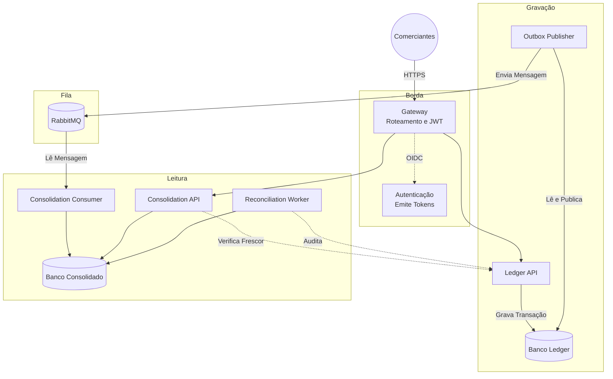

# Fluxo de Caixa para Comerciantes

Boas vindas ao sistema de controle de fluxo de caixa para comerciantes. Aqui, construímos um motor financeiro assíncrono e resiliente. O objetivo principal é muito claro: registrar débitos e créditos com total segurança e garantir que o comerciante consiga ver seu saldo consolidado diário. E o mais importante: se a leitura do saldo cair, a gravação de novos lançamentos nunca pode ser afetada.

Toda a arquitetura, as decisões técnicas e os diagramas estão na pasta [`docs/`](docs/). Abaixo, você encontra o guia completo de como o projeto funciona e como rodar tudo na sua própria máquina.

## O Problema que Resolvemos

Muitos sistemas financeiros antigos sofrem quando precisam calcular o saldo de milhares de lançamentos em tempo real. Eles travam o banco de dados e os clientes recebem mensagens de erro (timeouts). Nós resolvemos isso separando o problema em dois mundos:

1. **O Mundo da Gravação ([Ledger API](services/ledger)):** Recebe o registro de um débito ou crédito e salva imediatamente. Ele não calcula saldos nem espera nada. Apenas carimba que a transação aconteceu.
2. **O Mundo da Leitura ([Consolidation API](services/consolidation)):** Lê as transações que aconteceram no Ledger de forma assíncrona (usando filas RabbitMQ) e vai atualizando o saldo aos poucos. Quando o usuário pede para ver o saldo diário, a Consolidation API só consulta o valor pronto, retornando em milissegundos.

## Como Tudo Funciona

A arquitetura usa o padrão CQRS e Outbox Pattern. Veja como os componentes se conversam:



## Pré-requisitos

Para rodar este projeto localmente, você vai precisar de:
* Go 1.26.5
* Docker e Docker Compose (para subir a infraestrutura local)
* Opcional: GNU Make (fortemente recomendado para usar os atalhos)

As ferramentas de compilação de Protobuf e linters são baixadas automaticamente na pasta `.tools/bin` pelo comando de bootstrap. Você não precisa instalar nada globalmente.

Licenciado sob os termos do [MIT License](LICENSE).

## Como Rodar Localmente

É muito simples subir todo o ecossistema na sua máquina. Siga os passos:

1. **Baixe as ferramentas e prepare o código:**
```sh
make bootstrap
```

2. **Gere os segredos e certificados locais:**
```sh
go run scripts/generate-compose-secrets.go
```

3. **Suba toda a infraestrutura com Docker Compose:**
```sh
docker-compose up -d --build
```

Isso vai iniciar os bancos de dados PostgreSQL isolados, o RabbitMQ, o Keycloak para autenticação, o gateway KrakenD, as APIs de Ledger e Consolidation, além dos workers que conectam tudo debaixo do capô — detalhes de cada serviço e imagem em [`deploy/`](deploy/).

Por padrão, `docker compose up` sobe o perfil `app` (definido em [`.env`](.env)) — o ecossistema de negócio completo. Observabilidade real (Prometheus/Jaeger/Grafana) é um perfil separado, opcional:

```sh
docker compose --profile app --profile observability up -d --build
```

E carga (k6, containerizado) é outro:

```sh
docker compose --profile load-test run --rm k6            # via o rate limit do Edge (KrakenD)
docker compose --profile load-test run --rm k6-backend     # direto no Ledger/Consolidation, sem o Edge
```

Para provar que a subida limpa, o isolamento do Consolidado e a perda de uma réplica realmente funcionam (não só "deveriam"), rode os smoke tests reais em [`scripts/smoke/`](scripts/smoke/):

```sh
make smoke
```

## Autenticação e Exemplos Práticos

A nossa porta de entrada é o gateway na porta 8080 (normalmente mapeado no `/etc/hosts` como `edge.cashflow.local`). Como a segurança é nativa, você precisa de um token JWT válido para fazer qualquer requisição. A política de escopos/tenancy que a borda e cada serviço aplicam está em [ADR-004](docs/adrs/ADR-004-keycloak.md) e [ADR-011](docs/adrs/ADR-011-krakend-gateway.md).

### Obter um token e criar um lançamento

O realm `cashflow` já vem provisionado com os comerciantes de exemplo `merchant-a`/`merchant-b` (ver [`deploy/identity/keycloak/realm-cashflow.json`](deploy/identity/keycloak/realm-cashflow.json)). Peça um token via `grant_type=password` (client credentials para clientes de serviço, ver [`services/consolidation/cmd/reconciliation-worker`](services/consolidation/cmd/reconciliation-worker) para esse caso) pedindo explicitamente os escopos que a rota exige — sem `scope=` explícito o Keycloak devolve um token sem escopo algum, e toda rota protegida rejeita com 401:

```sh
TOKEN=$(curl -sk -X POST "https://localhost:8443/realms/cashflow/protocol/openid-connect/token" \
  -H "Host: edge.cashflow.local" \
  -d grant_type=password -d client_id=cashflow-merchant-app \
  -d username=merchant-a -d password=merchant-a-pass \
  -d scope="ledger:write ledger:read consolidation:read" \
  | python3 -c "import json,sys; print(json.load(sys.stdin)['access_token'])")
```

O KrakenD (ver [`deploy/edge/`](deploy/edge/)) faz `ssl_redirect` por padrão — em produção isso é resolvido por um balanceador terminando TLS na frente dele; localmente, simule enviando `X-Forwarded-Proto: https`:

```sh
curl -X POST http://localhost:8080/v1/entries \
  -H "Host: edge.cashflow.local" \
  -H "X-Forwarded-Proto: https" \
  -H "Authorization: Bearer $TOKEN" \
  -H "Content-Type: application/json" \
  -H "Idempotency-Key: $(python3 -c 'import uuid; print(uuid.uuid4())')" \
  -d '{"type":"ENTRY_TYPE_CREDIT","amount":"10.00","currency":"BRL","business_date":"2026-08-05","description":"exemplo"}'
```

E consultar o saldo consolidado do dia:

```sh
curl -X GET "http://localhost:8080/v1/daily-balances?date=2026-08-05" \
  -H "Host: edge.cashflow.local" \
  -H "X-Forwarded-Proto: https" \
  -H "Authorization: Bearer $TOKEN"
```

(O consolidado é assíncrono — se você consultar no mesmo instante do lançamento, o estado pode voltar `PROCESSING` por um instante antes de `UPDATED`; ver [`docs/arquitetura-alvo.md`](docs/arquitetura-alvo.md).)

Para simular e testar, preparamos testes comportamentais completos (BDD). Você pode visualizar todas as integrações funcionando perfeitamente rodando os cenários de teste E2E:

```sh
make integration
```

Este comando levanta contêineres temporários de teste, pega um token JWT real do Keycloak e simula dezenas de transações de crédito e débito, garantindo que o saldo bata perfeitamente no final.

## Testes e Evidências

Não escrevemos apenas testes unitários. Temos um catálogo completo de 81 cenários executáveis com a ferramenta Godog (nossa implementação de BDD em Go), rastreados em [`docs/testing-traceability.md`](docs/testing-traceability.md) e descritos em [`docs/testing-strategy.md`](docs/testing-strategy.md). Os cenários `.feature` em si moram em [`features/`](features/), e as evidências de carga (k6) e reconciliação em [`test/`](test/) e [`evidence/reports/`](evidence/reports/).

Para rodar o pacote de validação inteiro da CI, que inclui testes de concorrência, linters de segurança e quebra de contratos (breaking changes), rode:

```sh
make ci
make full-validation
```

## Falhas Comuns e Solução de Problemas (Troubleshooting)

Para incidentes operacionais reais (broker fora do ar, DLQ não vazia, gap de posição, watermark não verificável, perda de réplica), veja os runbooks em [`docs/runbooks/`](docs/runbooks/) — cada alerta do Prometheus ([`deploy/observability/prometheus/rules/`](deploy/observability/prometheus/rules/)) linka direto para o runbook correspondente. Para o dia a dia local:

* **As portas já estão em uso:** O Docker Compose sobe serviços nas portas 8080, 5432, 5672, etc. Certifique se de não ter outro Postgres ou RabbitMQ rodando na sua máquina.
* **O make falha no mac:** Instale o `make` nativo através do Homebrew (`brew install make`).
* **Meu token está dando Unauthorized (401):** O Token tem vida útil curta. Gere um novo fazendo um POST para o endpoint `/realms/cashflow/protocol/openid-connect/token` no Keycloak — e confirme que pediu os escopos certos com `scope=` (ver [Autenticação](#autenticação-e-exemplos-práticos) acima); sem escopo explícito o Keycloak emite um token válido mas sem nenhum escopo, que toda rota protegida rejeita.
* **401/EOF/"certificate has expired" ao autenticar, mesmo com o Compose de pé:** os certificados locais (`secrets/certs`, gerados por `go run scripts/generate-compose-secrets.go`) têm validade limitada. Rode o comando de novo (apague `secrets/certs/*` antes se ele reclamar que os arquivos já existem) e reinicie os serviços que dependem de TLS: `docker compose restart keycloak ledger-api consolidation-api reconciliation-worker krakend`.
* **`docker compose up` sobe mas `ledger-api`/`consolidation-api` não autenticam no Postgres:** confirme que os serviços `ledger-migrate`/`consolidation-migrate` rodaram e saíram com código 0 (`docker compose ps`) — são eles que criam as roles `ledger_app`/`consolidation_app` (ver [ADR-002](docs/adrs/ADR-002-isolamento-de-bancos.md)) antes de qualquer serviço de aplicação subir.
* **429 Too Many Requests num teste de carga:** esperado contra o Edge — o KrakenD limita a 20 req/s por IP de origem (`deploy/edge/krakend/krakend.json`). Isso mede o rate limit funcionando, não a capacidade do domínio; para medir o Ledger/Consolidado isolados, use `docker compose --profile load-test run --rm k6-backend` (ver [`docs/testing-traceability.md`](docs/testing-traceability.md), linha RNF-03).
* **O Saldo Consolidado não está atualizando:** Verifique se os contêineres `ledger-outbox-publisher` e `consolidation-consumer` estão rodando. Se eles pararem, as mensagens vão acumular no RabbitMQ e o saldo não vai refletir as transações recentes (mas nenhuma transação será perdida!). Runbook: [`docs/runbooks/broker.md`](docs/runbooks/broker.md).

## Documentação Extra

Gosta de saber os "por quês"? Nós também. Todos os diagramas, a tabela de mitigação de incidentes, a matriz de conformidade, e nossas Decisões de Arquitetura (ADRs) moram na pasta [`docs/`](docs/). Sugerimos fortemente a leitura do arquivo [`docs/arquitetura-alvo.md`](docs/arquitetura-alvo.md) para entender as escolhas difíceis e como blindamos este sistema para escalar sem medo.

| Documento | O que tem |
| --- | --- |
| [`docs/compliance-matrix.md`](docs/compliance-matrix.md) | Matriz CH-01..CH-11 do desafio, com o estado real (não aspiracional) de cada item e links para código/teste/evidência |
| [`docs/adrs/`](docs/adrs/) | 12 ADRs — contexto, decisão, alternativas rejeitadas, consequências e gatilho de revisão de cada escolha estrutural |
| [`docs/arquitetura-alvo.md`](docs/arquitetura-alvo.md) | Arquitetura alvo completa, com os diagramas |
| [`docs/arquitetura-de-transicao.md`](docs/arquitetura-de-transicao.md) | Como se chega da arquitetura legada até a alvo |
| [`docs/defesa-arquitetural.md`](docs/defesa-arquitetural.md) | Justificativa das escolhas mais discutíveis |
| [`docs/legado-e-incidentes.md`](docs/legado-e-incidentes.md) | Incidentes reais do sistema legado que motivaram cada decisão |
| [`docs/testing-strategy.md`](docs/testing-strategy.md) / [`docs/testing-traceability.md`](docs/testing-traceability.md) | Estratégia de testes e rastreabilidade RF/RNF → cenário → evidência |
| [`docs/contracts.md`](docs/contracts.md) | Contratos entre serviços (proto, eventos, versionamento) |
| [`docs/devsecops.md`](docs/devsecops.md) / [`docs/security-exceptions.md`](docs/security-exceptions.md) | Pipeline de segurança e exceções conhecidas e justificadas |
| [`docs/runbooks/`](docs/runbooks/) | Runbooks operacionais, um por classe de alerta |
| [`deploy/README.md`](deploy/README.md), [`cmd/README.md`](cmd/README.md), [`internal/README.md`](internal/README.md), [`test/README.md`](test/README.md) | READMEs de subpasta com o detalhe de cada área do monorepo |
