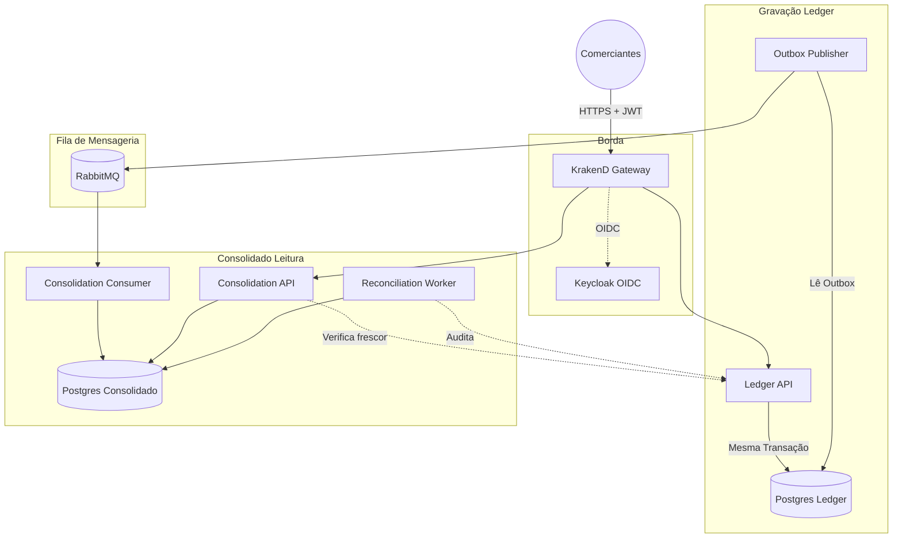
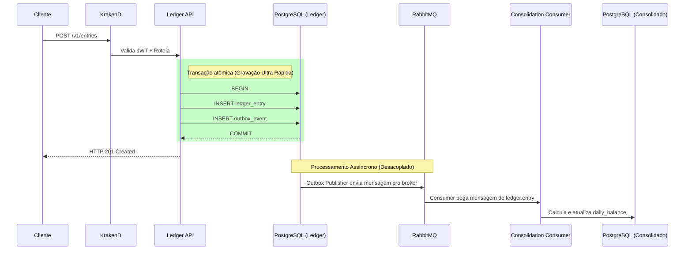

# Arquitetura Alvo

Aqui detalhamos como a arquitetura do sistema funciona na prática e resolve as falhas do passado. O objetivo principal é mostrar "o que acontece quando o lojista registra um lançamento" e os motivos das nossas escolhas tecnológicas.

## Problema Identificado e Decisões

Analisando o cenário legado, identificamos que processar requisições pesadas de leitura de saldo no mesmo banco de dados responsável por gravar transações gerava gargalos terríveis (locks de tabela e timeouts). Nesse caso, a recomendação é utilizar o padrão CQRS (Command Query Responsibility Segregation) com bancos isolados.

Foi definido o uso dessa abordagem guiada a eventos (Go, gRPC, RabbitMQ) porque:

1. **Acabamos com o lock compartilhado:** O Ledger só grava lançamentos rápidos. O Consolidado consome os eventos e calcula o saldo sem interferir na gravação. Com isso, conseguimos altíssima resiliência.
2. **Idempotência Nativa:** O envio exige a `Idempotency-Key`. Se a rede oscilar, o cliente pode reenviar a mesma chave que a API não criará o lançamento duas vezes.
3. **Fim dos timeouts:** O banco de Consolidação guarda a tabela do dia pré-calculada. O usuário consulta e recebe a resposta em milissegundos.
4. **Segurança no Gateway:** O KrakenD fica na borda barrando qualquer request sem token JWT ou escopo válido antes de encostar na infraestrutura financeira.
5. **Observabilidade de Ponta a Ponta:** Todo o fluxo carrega o `trace_id` (OpenTelemetry). O objetivo é conseguir buscar uma requisição desde a borda até o último consumidor sem precisar ficar pescando logs.

## Fluxo de Funcionamento Completo

O fluxo irá funcionar da seguinte forma: primeiro a requisição chega no KrakenD e é validada. Em seguida, a chamada é direcionada para o contexto correto (Ledger ou Consolidation). Cada domínio roda em seu próprio banco PostgreSQL, e a sincronização é mediada através da fila no RabbitMQ.

## Por que cada peça está separada?

| Componente | A Escolha Técnica |
| --- | --- |
| **KrakenD & Keycloak** | Centraliza a segurança. Se a validação de token morasse dentro do Ledger, um bug de roteamento poderia virar uma falha de autorização financeira grave. |
| **Ledger API** | A única fonte de verdade para os lançamentos. Ele grava o evento de Outbox junto com a transação para evitar a falha onde "gravou mas não avisou o resto do sistema". |
| **RabbitMQ** | Fila de transporte. Ele carrega a mensagem com tolerância a falhas. A garantia financeira vem da transação do banco, o RabbitMQ apenas provê a elasticidade e o tempo de esvaziamento das mensagens. |
| **Consolidation API** | Serve o saldo diário calculado previamente, nunca faz consultas matemáticas em tempo real cruzando a tabela histórica inteira. |
| **Bancos de Dados Isolados** | Cada serviço tem o seu `schema` e sua `role` (`ledger_app` / `consolidation_app`). Com isso, conseguimos mitigar o risco de um domínio derrubar o outro. |

## O Caminho do Lançamento

O diagrama abaixo prova o ponto principal: a gravação financeira é blindada e nunca aguarda a consolidação.

## Considerações Finais

Dessa forma, isolamos o problema, entregamos respostas em milissegundos e asseguramos escalabilidade.
