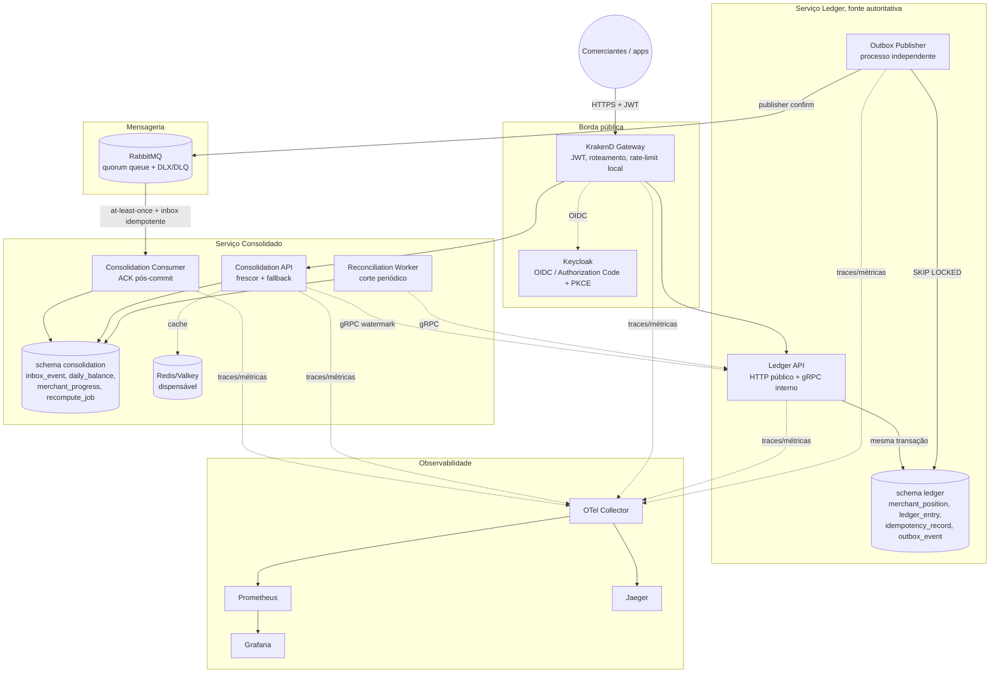
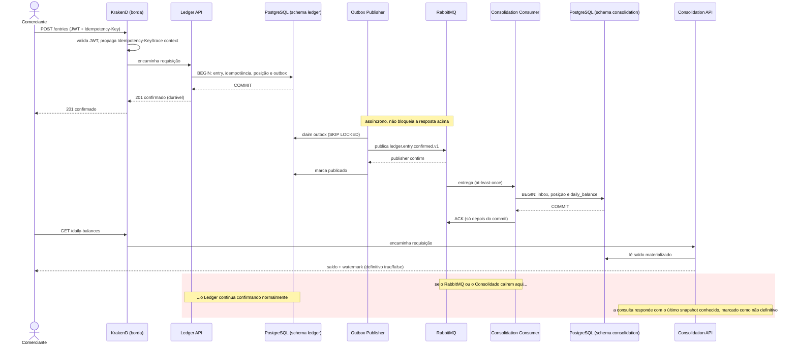

# Arquitetura Alvo

Aqui explico como a arquitetura nova ataca, componente a componente, os incidentes descritos em [O Legado e os Incidentes Reais](legado-e-incidentes.md). Também trago o diagrama completo do sistema e o fluxo de uma requisição do começo ao fim, para responder "o que acontece quando o comerciante registra um lançamento".

## 1. Por que essa arquitetura

A ideia central é orientação a eventos: Go, gRPC, AMQP e bancos separados por domínio. Cada ponto abaixo ataca diretamente um problema do legado.

1. **CQRS acaba com o lock compartilhado.** O Ledger só grava (append-only) e responde ao cliente na hora. O Consolidado lê os eventos de forma assíncrona. Não tem mais briga entre registrar uma venda e atualizar saldo na mesma transação.
2. **Idempotência já nasce no contrato.** A API em Protobuf exige `Idempotency-Key` e `merchant_position`, então um clique duplo não duplica saldo nem lançamento.
3. **Os relatórios param de dar timeout.** O banco do Consolidado guarda a informação pré-calculada. Um `GET /v1/daily-balances` responde em milissegundos, não importa se o Ledger já tem um bilhão de lançamentos.
4. **Escala horizontal de verdade.** Com Go e os serviços separados (Ledger e Consolidado), a ideia de "servidor único" simplesmente deixa de existir. Cada peça escala de acordo com o próprio gargalo.
5. **Segurança nativa, não colada por cima.** O gateway e os contratos Protobuf já mapeiam `401` e `403` de forma explícita no OpenAPI. Não tem como chegar no Ledger sem identidade e escopo validados.
6. **Observabilidade de ponta a ponta.** O evento AMQP carrega `traceparent` (W3C Trace Context) obrigatoriamente, então dá pra seguir um request desde o gateway até a confirmação no RabbitMQ e o consumo pelo Consolidado, sem depender de log solto.

---

## 2. O sistema completo

O legado era uma caixa só fazendo tudo. Aqui cada responsabilidade vira um componente com autoridade, réplica e domínio de falha próprios. Nada disso é hipotético: Ledger, Outbox Publisher, Consolidation Consumer/API e a borda de identidade já rodam com código real, testados contra PostgreSQL, RabbitMQ, Keycloak e KrakenD de verdade neste repositório.

### Por que cada peça está separada, e não junto de outra

| Componente | O que faz | Por que não junta com outro componente |
| --- | --- | --- |
| KrakenD | É a única borda HTTP pública. Valida JWT, roteia, propaga `Idempotency-Key`/trace context e nunca repete um `POST` sozinho. | Se a validação de borda morasse dentro do Ledger, um bug de roteamento viraria um bug de autorização financeira. |
| Keycloak | Emite os tokens OIDC (Authorization Code + PKCE) com claims de `merchant_id` e escopo. | Trocar isso por uma validação caseira volta a abrir o IDOR do Cenário 4 do legado. |
| Ledger API | É a única fonte de verdade dos lançamentos. Grava entry, idempotência, posição e outbox numa transação só. | É essa transação única que resolve o Cenário 1 e o Cenário 3 do legado ao mesmo tempo. Sem ela, qualquer camada acima continua exposta a dupla escrita. |
| Outbox Publisher | Roda separado, drena a outbox com `SKIP LOCKED` e só marca como publicado depois da confirmação do broker. | Se isso acontecesse dentro do próprio request do Ledger, uma queda do RabbitMQ voltaria a travar o `POST /entries`. É exatamente esse requisito que a arquitetura existe pra resolver. |
| RabbitMQ (quorum + DLX/DLQ) | Transporta o evento `ledger.entry.confirmed.v1` com entrega garantida pelo menos uma vez. | A garantia financeira não vem do broker, vem da transação mais a idempotência. Isso é o que permite o Ledger nunca esperar o Consolidado. |
| Consolidation Consumer | Consome o evento, aplica no read model e só dá ACK depois do commit. | Resolve o Cenário 2 do legado porque o consumo é assíncrono e nunca compete com o `INSERT` do Ledger. |
| Consolidation API | Serve o saldo já calculado, nunca faz `SUM` em tempo real sobre o histórico inteiro. | É isso que elimina o full table scan de 45 segundos do legado. |
| Reconciliation Worker | Compara Ledger e Consolidado periodicamente por um corte estável, e prova zero ausentes, extras ou duplicados. | Substitui a "esperança" do legado por uma prova numérica que se repete. |
| PostgreSQL com schemas isolados (`ledger`, `consolidation`, `identity`) | Cada serviço tem role e schema próprios, sem join, FK ou transação cruzando domínios. | Mantém o isolamento de falha mesmo compartilhando o mesmo cluster físico por questão de custo. |
| OTel Collector, Prometheus, Grafana, Jaeger | Correlacionam traço, métrica e log por `trace_id`, `entry_id` e `event_id`, sem nenhum dado sensível. | É a resposta direta ao "voo cego" do Cenário 4 do legado. |

---

## 3. O caminho de uma requisição

Este diagrama serve pra responder "me explica o que acontece quando alguém registra um lançamento". O ponto principal: o registro nunca espera a consolidação, e uma queda do RabbitMQ ou do Consolidado não chega a aparecer pro comerciante.

Três coisas que essa sequência já prova sozinha:

- A resposta `201` ao comerciante acontece antes de qualquer interação com RabbitMQ ou Consolidado. Não existe, em nenhum ponto do fluxo, uma chamada síncrona do Ledger pro Consolidado.
- O ACK do consumer só acontece depois do commit no schema `consolidation`. Uma reentrega antes disso é segura porque `event_id` e posição são únicos.
- A consulta nunca finge que um valor desatualizado é definitivo. O campo `definitivo` é justamente essa diferença: "ainda não vi esse evento" versus "está tudo errado".

---

Anterior: [O Legado e os Incidentes Reais](legado-e-incidentes.md). Próximo: [Arquitetura de Transição](arquitetura-de-transicao.md).
