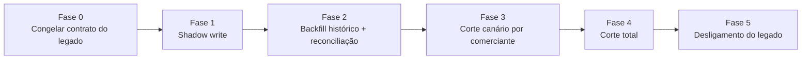

# Arquitetura de Transição (Legado → Novo)

Trocar um sistema financeiro em produção de uma vez só é um risco grande demais. Uma virada única é exatamente o tipo de indisponibilidade que este projeto quer eliminar. Por isso a transição segue o padrão Strangler Fig: o sistema novo cresce ao redor do legado e vai assumindo fatias de tráfego aos poucos, enquanto o legado continua sendo a fonte de verdade até o novo provar que chega no mesmo resultado.

### Fase 0: congelar o contrato

O monolito legado para de receber funcionalidade nova. O schema de `lancamentos`/`saldos_diarios` fica documentado como contrato de leitura pra fase de backfill. Nenhuma migração de dado começa antes disso, senão a gente fica perseguindo um alvo que ainda está mudando.

### Fase 1: shadow write

O KrakenD passa a espelhar cada `POST /lancamentos` também pra nova Ledger API, fora do caminho crítico do cliente (fire-and-forget). O legado continua sendo a única resposta que o cliente vê. O objetivo aqui é só um: provar, sob carga real, que a Ledger nova grava o mesmo resultado financeiro que o legado. Sem risco nenhum, porque nada novo está sendo servido ainda.

Rollback: é só desligar o espelhamento. Zero impacto, o legado nunca deixou de ser a fonte de verdade.

### Fase 2: backfill histórico e reconciliação

Um job em lote lê o histórico do banco único do legado (respeitando o contrato congelado na Fase 0) e replica pro schema `ledger` novo, guardando `entry_id`, data e valor originais como `original_entry_id`/posição. Nada de reprocessar regra de negócio antiga do jeito errado. Logo depois, o Reconciliation Worker, que já é parte da [arquitetura alvo](arquitetura-alvo.md) e não uma ferramenta descartável de migração, roda comparando contagem e soma do legado contra o Ledger novo, por comerciante e por dia. Só avança quem fechar em zero divergência.

Rollback: o backfill é idempotente e pode ser refeito quantas vezes precisar, porque nenhuma escrita acontece no legado durante esse processo.

### Fase 3: corte canário por comerciante

Agora o KrakenD passa a rotear a resposta de verdade pra stack nova, mas só pra um grupo pequeno e reversível de comerciantes. O resto continua no legado. O shadow write da Fase 1 se inverte pra esse grupo: é o legado que passa a receber a cópia assíncrona, só pra garantir rollback instantâneo se precisar. O critério pra promover mais comerciantes é simples: nenhuma divergência de saldo, nenhum aumento de erro 5xx, e p95 dentro do SLO por um período definido (um ciclo de fechamento diário completo, por exemplo).

Rollback: voltar o roteamento do canário pro legado é só uma mudança de configuração no KrakenD, não uma migração de dado. O legado nunca parou de receber a cópia espelhada desses comerciantes.

### Fase 4: corte total

Com o canário estável, o roteamento migra 100% dos comerciantes pra stack nova. O legado para de receber escrita nova, mas continua de pé, só leitura, como fonte de auditoria e plano de contingência imediato.

Rollback: ainda dá pra reverter o roteamento do KrakenD pro legado enquanto ele estiver de pé e não tiver sido desligado de vez. Essa é a última fase em que o rollback ainda é barato.

### Fase 5: reconciliação contínua e desligamento

Depois de um período de estabilização sem divergência (um ciclo de fechamento contábil completo, por exemplo), o legado é desligado. A partir daqui a "reconciliação de migração" simplesmente vira a reconciliação operacional que já estava prevista na arquitetura alvo. Não é descartada, é o mesmo componente continuando o trabalho.

### Por que essa estratégia e não outra

| Alternativa considerada | Por que foi descartada |
| --- | --- |
| Big bang (trocar tudo num fim de semana) | Repete o próprio risco que motivou a reescrita: qualquer inconsistência de saldo só aparece depois que já afetou o cliente. |
| Dual-write permanente, sem nunca desligar o legado | Mantém o domínio de falha do legado (servidor único, sem idempotência) como uma dependência que nunca termina. |
| Migrar o dado primeiro e o código depois | Sem a Ledger nova já validada pelo shadow write, o backfill não teria como provar paridade antes do corte. |

---

Anterior: [Arquitetura Alvo](arquitetura-alvo.md). Próximo: [Defesa do Modelo](defesa-arquitetural.md).
