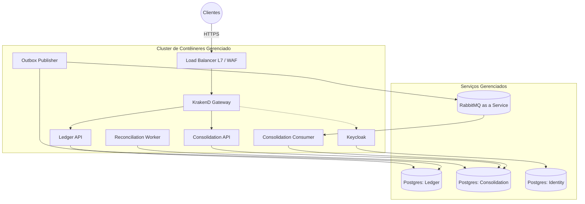

# Projeção de Custos Cloud e Trade-offs

Abaixo detalhamos a arquitetura de implantação em provedores de nuvem (AWS, GCP e Azure), as estimativas de custos para suportar o sistema de Fluxo de Caixa e a recomendação final de qual caminho seguir.

## Arquitetura Cloud Alvo

Analisando o cenário de implantação em nuvem, a recomendação é utilizar serviços gerenciados (*Managed Services*) para bancos de dados e mensageria, além de orquestração de contêineres para as APIs e Workers. O diagrama abaixo ilustra como o ecossistema funcionará:

## Estimativa Base por Cloud Provider

Considerando um ambiente resiliente (Multi-AZ) para lidar com um volume transacional de até 500 requisições por segundo, as projeções financeiras estimadas (por mês) são as seguintes:

### 1. Amazon Web Services (AWS)
* **Compute:** EKS (Elastic Kubernetes Service) + EC2/Fargate (~$200)
* **Database:** Amazon RDS for PostgreSQL (Multi-AZ, db.t4g.medium) (~$150)
* **Broker:** Amazon MQ for RabbitMQ (~$100)
* **Networking & Edge:** ALB + NAT Gateway + Data Egress (~$100)
* **Custo Mensal Estimado:** ~$550

### 2. Google Cloud Platform (GCP)
* **Compute:** GKE (Google Kubernetes Engine) ou Cloud Run (~$160)
* **Database:** Cloud SQL for PostgreSQL (High Availability) (~$140)
* **Broker:** CloudAMQP (SaaS parceiro) ou instâncias GCE auto-gerenciadas (~$100)
* **Networking & Edge:** Cloud Load Balancing + Cloud NAT (~$80)
* **Custo Mensal Estimado:** ~$480

### 3. Microsoft Azure
* **Compute:** AKS (Azure Kubernetes Service) (~$180)
* **Database:** Azure Database for PostgreSQL Flexible Server (Zone Redundant) (~$160)
* **Broker:** CloudAMQP ou instâncias VM auto-gerenciadas (~$100)
* **Networking & Edge:** Application Gateway + Bandwidth (~$90)
* **Custo Mensal Estimado:** ~$530

## Trade-offs e Recomendação Final

Analisando as opções frente à arquitetura do sistema, identificamos os seguintes trade-offs:

| Provedor | Benefício | Ponto de Atenção |
| --- | --- | --- |
| **AWS** | Maturidade extrema. É a única que oferece o **Amazon MQ for RabbitMQ**, garantindo que o ecossistema inteiro seja gerenciado nativamente sem depender de terceiros. | O custo fixo de rede (NAT Gateway e Egress) costuma encarecer agressivamente em altos volumes. |
| **GCP** | O GKE é o melhor e mais barato orquestrador Kubernetes do mercado. O Cloud SQL possui ótimo custo-benefício. | Não possui serviço gerenciado nativo de RabbitMQ, obrigando a gestão própria no Kubernetes ou a contratação de um SaaS (CloudAMQP). |
| **Azure** | Ideal caso o cliente já utilize o ecossistema Microsoft (Integração com Entra ID). | A curva de aprendizado para a gestão do AKS e das redes (VNets) é um pouco mais complexa. |

**A recomendação final:**

Foi definido o uso da **AWS** como o alvo primário para esta arquitetura. Como o sistema depende criticamente da estabilidade e persistência do RabbitMQ (para a sincronização entre Ledger e Consolidado), ter o broker como serviço gerenciado nativo (Amazon MQ) elimina uma carga operacional imensa da equipe. Com isso, conseguimos governança unificada (IAM, VPC, CloudWatch) e alta disponibilidade out-of-the-box para todas as peças chaves da infraestrutura.
