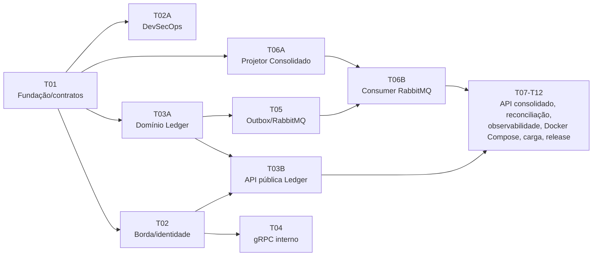

# Defesa do Modelo

Aqui está o de-para de decisões, e a jornada de implementação que sustenta a resposta pra "isso realmente funciona?". Não como promessa, mas como um processo que já encontrou e corrigiu bugs de verdade antes de qualquer integração.

## 1. De-para de decisões

| Problema real do legado | O que a arquitetura nova faz | Onde isso já está provado neste repositório |
| --- | --- | --- |
| Cenário 1: deadlock de `UPDATE` concorrente no mesmo comerciante | O Ledger é append-only. O saldo é recomputado depois, de forma assíncrona, nunca na mesma transação da escrita. | Transação única grava entry, idempotência, posição e outbox junto. Teste de concorrência real no domínio do Ledger. |
| Cenário 2: `SELECT SUM` de 45 segundos numa tabela histórica | O read model (`daily_balance`) já vem pré-calculado, atualizado por evento. A leitura nunca soma o histórico inteiro. | Consolidation API e o projetor materializam o saldo por dia. Testes reais com PostgreSQL mostram consulta imediata. |
| Cenário 3: sem `Idempotency-Key`, saldo duplicava | A chave é obrigatória no contrato Protobuf/HTTP e a unicidade vem de `idempotency_record`, gravado na mesma transação do lançamento. | Cenários BDD de duplicidade (`impedir-duplicidade-lancamentos.feature`) e testes reais de retry/duplicata no outbox. |
| Cenário 4: IDOR e falta de autenticação | O `merchant_id` vem só do JWT validado (Keycloak, KrakenD e uma nova checagem no serviço). Nunca é aceito do payload. | Testes reais com token ausente, expirado, com assinatura inválida ou sem escopo, todos rejeitados sem tocar em nenhum dado, provando que a borda nem encaminha a chamada. |
| Cenário 4: servidor único, ponto único de falha | Cada serviço roda com várias réplicas atrás de balanceamento. Uma queda do Consolidado ou do RabbitMQ não afeta o Ledger. | Teste que derruba o Consolidado de propósito e mostra os lançamentos continuando a ser confirmados durante a queda. |
| Cenário 4: sem log nem tracing | OpenTelemetry cobre tudo de ponta a ponta (`traceparent` obrigatório no evento AMQP). Logs estruturados sem nenhum dado sensível. | Coletor OTLP real inspecionado nos testes, provando que JWT, valor e descrição não aparecem em log nem em trace. |

Os cenários citados acima estão detalhados em [O Legado e os Incidentes Reais](legado-e-incidentes.md). Essa tabela é o que sustenta a resposta pra "por que essa arquitetura e não outra": cada decisão técnica vem de um incidente real do sistema anterior, não de uma preferência por microsserviços porque sim.

---

## 2. Como isso foi construído, e como sabemos que funciona

Essa seção existe pra responder a pergunta mais difícil de uma entrevista técnica: como você garante que isso realmente funciona, e não é só um diagrama bonito?

### Ordem de construção

### A regra que sustenta tudo: ninguém aceita a própria palavra

Todo ticket do diagrama acima passou pelo mesmo funil antes de ser integrado. Primeiro a implementação, depois os gates reais (build, `go vet`, testes com `-race`, PostgreSQL/RabbitMQ/Keycloak/KrakenD de verdade, segurança, SBOM), e só então uma revisão focal feita por um agente independente, sem o contexto de quem implementou. Nenhum cenário de BDD é aceito por um contador genérico ou uma lista de string. O oráculo tem que observar um efeito real: uma linha no banco, uma mensagem no broker, uma resposta HTTP.

Esse processo já encontrou, e corrigiu, os seguintes problemas antes deles chegarem perto de produção:

| Onde | O que a revisão independente encontrou | Por que isso importa numa entrevista |
| --- | --- | --- |
| Borda (T02), primeira rodada | O PKCE quebrava porque o timeout do gateway (5s) era menor que o orçamento real do fluxo OIDC (15s). | Mostra um teste de integração real pegando um problema que só aparece sob timeout de produção, nunca num unit test. |
| Borda (T02), rodadas 2 e 3 | A evidência de BDD estava "superdeclarada": o binding só conferia uma lista de string, não o comportamento literal do cenário. E dado sensível vazava pelo `tracestate` do trace context. | Prova que "os testes passam" não é a mesma coisa que "o comportamento está correto", e que dá pra verificar essa diferença. |
| Borda (T02), quarta rodada | Mesmo depois de "corrigido", o healthcheck novo ainda expunha `/__health` na porta pública. A evidência ainda podia ser fabricada recalculando o próprio checksum. O oráculo de "sem encaminhamento indevido" só olhava um contador pós-autenticação, não a entrada real. E o critério de anti-enumeração aceitava uma diferença de tempo de 2x, perfeitamente distinguível. | Cada correção foi verificada de novo, do zero. Nenhuma suposição de que uma correção anterior continuava valendo. |
| Borda (T02), quinta rodada | A correção anterior (assinar a evidência com HMAC) vazava a própria chave pelo eco padrão do `make`, em qualquer log de CI. Dava pra pegar essa chave e re-assinar uma evidência antiga sem rodar nada de verdade. | O bug mais sutil de toda a série. A correção de um problema de segurança abriu, no mesmo commit, o canal pra reabrir esse mesmo problema. Só apareceu porque o revisor reproduziu o ataque de ponta a ponta. |
| Outbox/RabbitMQ (T05) | A fila usava dead-lettering `at-most-once`, que podia perder mensagem antes dela chegar na DLQ. Um fixup posterior quebraria o deploy em cima da fila que já existia em produção. E um teste de queda da DLQ tinha um panic sem tratamento que deixava container vazando. | Prova de disciplina no rollout: nenhuma correção foi aceita até provar uma migração segura em cima do estado que já existia, não só num ambiente vazio. |

### O que isso demonstra

Zero perda financeira não é um slogan aqui. É testado derrubando o RabbitMQ e o Consolidado de propósito enquanto os lançamentos continuam sendo confirmados, e depois provando que 100% deles foram aplicados exatamente uma vez.

Segurança foi tratada como código, não como checklist marcado uma vez só. Foram cinco rodadas de correção só na borda, cada uma achando um bypass novo e mais sutil que o anterior, até fechar de verdade.

A própria evidência de teste foi tratada como uma superfície de ataque. O processo desconfiou até da prova de que os testes passaram, e isso pegou um bug real que passaria despercebido em qualquer auditoria superficial.

E nenhum pedaço do legado foi trocado sem antes nomear o incidente específico que ele causava. A tabela da Seção 1 é essa prova: não existe decisão arquitetural aqui que seja só "porque é mais moderno".

---

Anterior: [Arquitetura de Transição](arquitetura-de-transicao.md).
