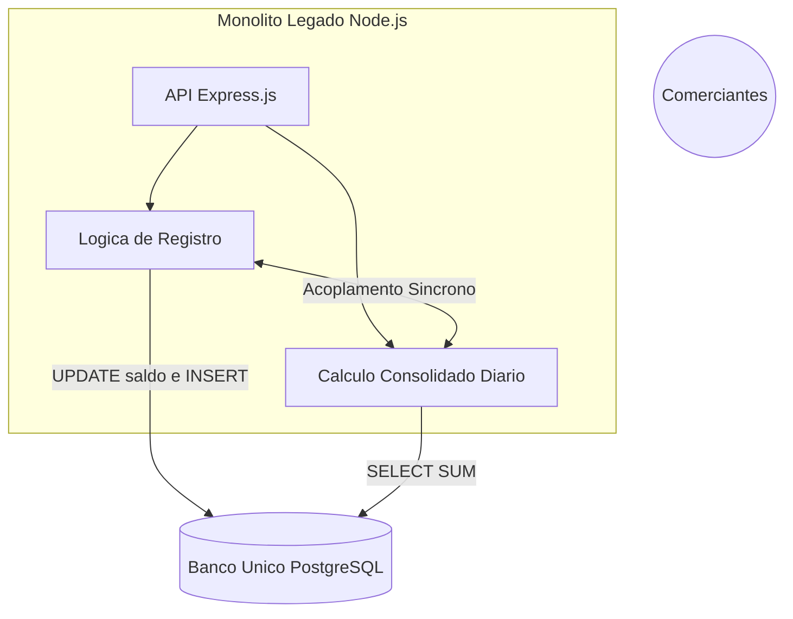
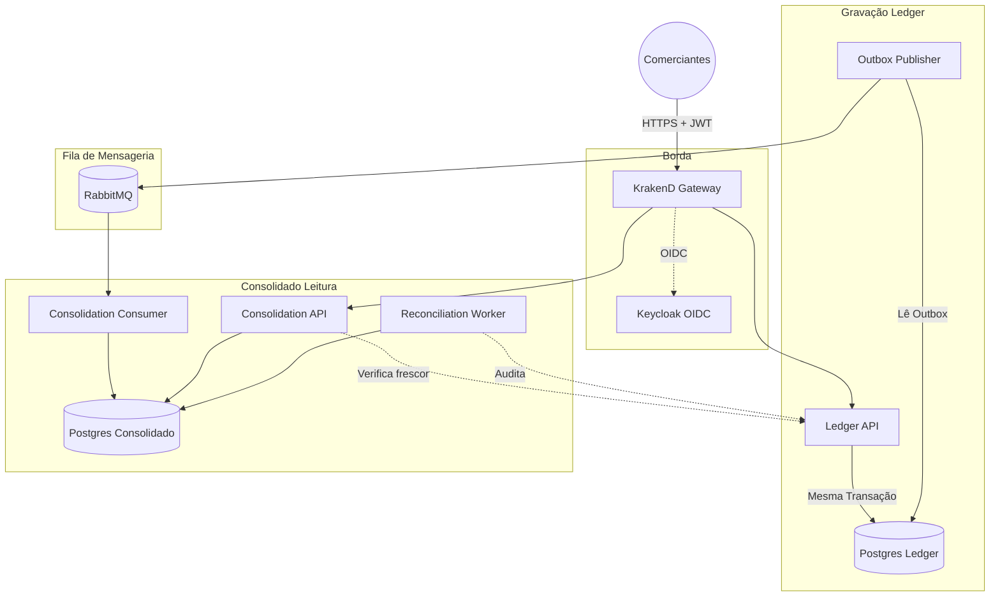
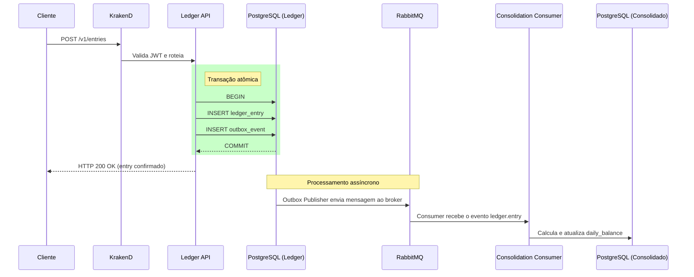
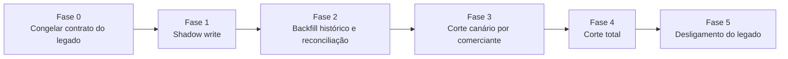
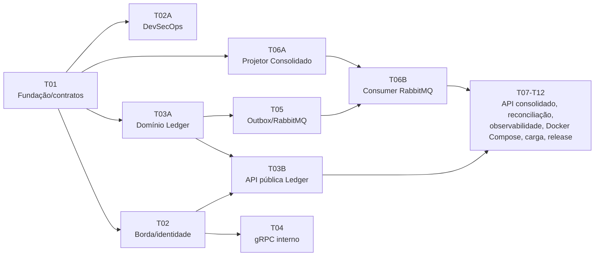

# Legado, Arquitetura Alvo e Migração

> Nota: o sistema legado descrito abaixo é fictício. Ele foi criado como cenário de referência para justificar, com incidentes concretos, cada decisão de arquitetura adotada neste projeto.

Este documento cobre, em ordem: o sistema legado hipotético e os incidentes que motivariam sua reescrita, a arquitetura alvo e as razões de cada decisão, o plano de migração do legado para o novo sistema, e a relação entre cada decisão e a evidência de que ela funciona.

## 1. O sistema legado

### 1.1 Arquitetura anterior

O sistema legado hipotético é uma aplicação monolítica em Node.js (Express, JavaScript sem tipagem estática), com um único banco de dados relacional compartilhado entre as operações de registro (Ledger) e de cálculo (Consolidado Diário).

Características principais:

- Node.js com Express e um ORM (Sequelize ou TypeORM) sem otimização de consultas.
- Um único banco de dados, usado tanto para gravação transacional quanto para relatórios analíticos.
- Transações longas e síncronas: o registro de um lançamento já incluía o recálculo do saldo do comerciante, na mesma chamada.
- Um único servidor, sem réplicas nem escalabilidade horizontal.
- Nenhuma camada de autorização formalizada e ausência de logs estruturados ou rastreamento de chamadas.

### 1.2 Cenários de falha

O sistema passava nos testes locais, mas apresentava falhas críticas em produção, sob concorrência e carga real.

**Cenário 1: deadlocks sob concorrência.** No fechamento das lojas, próximo das 18h, muitos comerciantes registravam lançamentos de cartão ao mesmo tempo. A rota `POST /lancamentos` inseria a entrada e, na mesma transação, executava um `UPDATE saldos_diarios SET saldo = saldo + X WHERE comerciante = Y`. Requisições simultâneas para o mesmo comerciante geravam bloqueios de linha no banco, e o Node.js não tratava bem o retry dessas transações, esgotando o pool de conexões. O resultado era um timeout (504) para o cliente, mas em alguns casos o `insert` já havia sido confirmado e o `update` não, gerando divergência entre o extrato e o saldo total.

**Cenário 2: timeouts em relatórios consolidados.** No início de cada mês, os gestores consultavam o consolidado dos últimos 30 dias. A rota `GET /relatorios/consolidado` executava `SELECT SUM(...) FROM lancamentos WHERE data BETWEEN ... GROUP BY data` sobre uma tabela com centenas de milhões de linhas, sem separação entre carga transacional e analítica. A consulta levava mais de 45 segundos, e o proxy na frente da aplicação encerrava a conexão em 30. O processamento pesado ainda ocupava o event loop do Node.js, degradando até o registro de uma venda simples.

**Cenário 3: ausência de idempotência.** Sob instabilidade de rede móvel, o aplicativo do lojista podia interpretar uma requisição lenta como falha e reenviá-la automaticamente. Sem uma chave de idempotência, o backend processava as duas chamadas, duplicando o lançamento financeiro e o crédito no saldo do comerciante.

**Cenário 4: autenticação e observabilidade insuficientes.** A API não validava tokens nem autorização de forma rigorosa, permitindo que a simples alteração do identificador do cliente numa requisição expusesse dados de terceiros (IDOR). Por rodar em um único servidor, qualquer indisponibilidade tirava todos os clientes do ar. E, sem logs estruturados ou tracing, um erro em produção retornava apenas um HTTP 500 genérico, obrigando o suporte a acessar o servidor diretamente para investigar arquivos de log dispersos.

## 2. Arquitetura alvo

### 2.1 Decisões e motivação

Os quatro cenários da seção anterior têm uma origem comum: gravação e leitura competindo pelo mesmo banco, sem isolamento de responsabilidades, autenticação centralizada ou observabilidade. A decisão foi adotar CQRS (Command Query Responsibility Segregation) com bancos de dados isolados por domínio, implementado em Go, com comunicação assíncrona via RabbitMQ e proteção de borda via API Gateway.

As principais consequências dessa escolha:

1. **Gravação e leitura deixam de competir pelo mesmo recurso.** O Ledger grava lançamentos de forma rápida e append-only. O Consolidado consome os eventos gerados e calcula o saldo de forma assíncrona, sem interferir na escrita.
2. **Idempotência é parte do contrato.** Toda escrita exige uma `Idempotency-Key`. Se a rede falhar e o cliente reenviar a mesma chave, a API não cria um novo lançamento.
3. **A leitura do saldo deixa de depender de agregação em tempo real.** A Consolidation API mantém uma tabela pré-calculada por dia, atualizada por evento, e responde em milissegundos.
4. **A segurança é centralizada na borda.** O KrakenD valida token JWT e escopo antes de qualquer requisição alcançar a infraestrutura financeira.
5. **Toda a cadeia é observável.** Um `trace_id` (OpenTelemetry) acompanha a requisição da borda até o último consumidor, permitindo localizar qualquer chamada sem depender de busca manual em logs.

### 2.2 Fluxo de uma requisição

A requisição chega ao KrakenD e é validada. Em seguida, é encaminhada ao domínio correto (Ledger ou Consolidation). Cada domínio mantém seu próprio banco PostgreSQL, e a sincronização entre eles é mediada pela fila no RabbitMQ.

### 2.3 Responsabilidade de cada componente

| Componente | Papel na arquitetura |
| --- | --- |
| KrakenD e Keycloak | Centralizam autenticação e autorização. Se essa validação estivesse dentro do Ledger, um erro de roteamento poderia se tornar uma falha de autorização financeira. |
| Ledger API | Fonte única de verdade para os lançamentos. Grava o evento de outbox na mesma transação do lançamento, evitando o cenário em que a escrita é confirmada mas o restante do sistema nunca é avisado. |
| RabbitMQ | Transporte assíncrono e tolerante a falhas. A garantia financeira vem da transação do banco; o RabbitMQ apenas fornece elasticidade e desacoplamento temporal entre gravação e leitura. |
| Consolidation API | Responde com o saldo diário já calculado, sem consultas analíticas em tempo real sobre o histórico completo. |
| Bancos de dados isolados | Cada serviço tem schema e role próprios (`ledger_app`, `consolidation_app`), reduzindo o risco de um domínio afetar o outro. |

### 2.4 O caminho de um lançamento

O diagrama de sequência abaixo evidencia o ponto central da arquitetura: a confirmação de um lançamento não depende da consolidação.

Com essa separação, a gravação responde em milissegundos e a leitura escala de forma independente.

## 3. Migração do legado (Strangler Fig)

Substituir um sistema financeiro em produção de uma só vez concentra risco demais: qualquer inconsistência só apareceria depois de já ter afetado o cliente. Por isso a transição segue o padrão Strangler Fig, no qual o sistema novo cresce ao redor do legado e assume o tráfego de forma gradual, enquanto o legado permanece como fonte de verdade até o novo sistema comprovar paridade de resultado.

**Fase 0, congelamento do contrato.** O monolito legado deixa de receber novas funcionalidades. O schema de `lancamentos` e `saldos_diarios` é documentado como contrato de leitura para a fase de backfill. Nenhuma migração de dado começa antes desse congelamento.

**Fase 1, shadow write.** O KrakenD passa a espelhar cada `POST /lancamentos` também para a Ledger API nova, fora do caminho crítico do cliente. O legado continua sendo a única resposta que o cliente recebe. O objetivo é comprovar, sob carga real, que a Ledger nova grava o mesmo resultado financeiro que o legado, sem qualquer risco, já que nada novo está sendo servido. Reversão: basta desligar o espelhamento, sem impacto.

**Fase 2, backfill e reconciliação.** Um processo em lote lê o histórico do banco único do legado, respeitando o contrato congelado na Fase 0, e o replica para o schema `ledger` novo, preservando `entry_id`, data e valor originais como `original_entry_id` e posição. Em seguida, o Reconciliation Worker, componente permanente da arquitetura alvo e não uma ferramenta descartável de migração, compara contagem e soma entre o legado e o Ledger novo, por comerciante e por dia. Só avança a fase seguinte quem fechar em zero divergência. Reversão: o backfill é idempotente e pode ser refeito quantas vezes for necessário, pois nenhuma escrita ocorre no legado durante o processo.

**Fase 3, corte canário por comerciante.** O KrakenD passa a rotear a resposta real para a stack nova, mas apenas para um grupo pequeno e reversível de comerciantes. Para esse grupo, o shadow write se inverte: é o legado que recebe a cópia assíncrona, garantindo reversão imediata se necessário. O critério para promover mais comerciantes é objetivo: nenhuma divergência de saldo, nenhum aumento de erro 5xx, e p95 dentro do SLO por um ciclo de fechamento diário completo. Reversão: alterar o roteamento no KrakenD de volta para o legado, sem qualquer migração de dado.

**Fase 4, corte total.** Com o canário estável, o roteamento migra a totalidade dos comerciantes para a stack nova. O legado deixa de receber escrita, mas permanece disponível em modo leitura, como fonte de auditoria e plano de contingência. Reversão: ainda possível, enquanto o legado estiver ativo, mas essa é a última fase em que reverter tem baixo custo.

**Fase 5, reconciliação contínua e desligamento.** Após um período de estabilização sem divergência, equivalente a um ciclo de fechamento contábil completo, o legado é desligado. A partir desse ponto, a reconciliação de migração passa a ser simplesmente a reconciliação operacional já prevista na arquitetura alvo: o mesmo componente continua em uso, sem descontinuidade.

### Alternativas consideradas

| Alternativa | Motivo da rejeição |
| --- | --- |
| Corte único (big bang) | Reproduz o mesmo risco que motivou a reescrita: uma inconsistência de saldo só seria percebida depois de já ter afetado o cliente. |
| Dual write permanente, sem desligar o legado | Mantém indefinidamente o domínio de falha do legado (servidor único, sem idempotência) como dependência do sistema novo. |
| Migrar o dado antes do código | Sem a Ledger nova validada pelo shadow write, o backfill não teria como comprovar paridade antes do corte. |

## 4. Da decisão à verificação

### 4.1 Relação entre incidente, decisão e evidência

| Problema no sistema legado | Solução na arquitetura nova | Evidência no repositório |
| --- | --- | --- |
| Cenário 1: deadlock em atualização concorrente do mesmo comerciante | O Ledger é append-only; o saldo é recomputado de forma assíncrona, fora da transação de escrita. | Transação única grava lançamento, idempotência, posição e outbox em conjunto, com teste de concorrência sobre o domínio do Ledger. |
| Cenário 2: agregação de 45 segundos sobre tabela histórica | O read model (`daily_balance`) já é pré-calculado e atualizado por evento; a leitura nunca soma o histórico completo. | Consolidation API e o projetor materializam o saldo por dia; testes de integração com PostgreSQL confirmam resposta imediata. |
| Cenário 3: duplicidade por ausência de chave de idempotência | A `Idempotency-Key` é obrigatória no contrato, e a unicidade é garantida por `idempotency_record`, gravado na mesma transação do lançamento. | Cenário de BDD dedicado a duplicidade e testes de retry sobre o outbox. |
| Cenário 4: IDOR e ausência de autenticação | O `merchant_id` é derivado exclusivamente do JWT validado (Keycloak, KrakenD e uma checagem adicional no serviço), nunca aceito a partir do payload. | Testes com token ausente, expirado, com assinatura inválida ou sem escopo, todos rejeitados antes de qualquer acesso a dado. |
| Cenário 4: servidor único como ponto único de falha | Cada serviço opera com múltiplas réplicas atrás de balanceamento; a indisponibilidade do Consolidado ou do RabbitMQ não afeta o Ledger. | Teste que interrompe o Consolidado deliberadamente e confirma que os lançamentos continuam sendo confirmados durante a interrupção. |
| Cenário 4: ausência de logs e rastreamento | OpenTelemetry cobre a cadeia completa, com `traceparent` obrigatório no evento AMQP, e logs estruturados sem dados sensíveis. | Coletor OTLP inspecionado em teste, confirmando que token, valor e descrição não aparecem em log nem em trace. |

Cada decisão de arquitetura está associada a um incidente concreto do sistema anterior, não a uma preferência isolada por um estilo de arquitetura.

### 4.2 Como a implementação foi verificada

Cada etapa do diagrama acima segue o mesmo processo antes de ser integrada: implementação, seguida dos gates automatizados (build, `go vet`, testes com detecção de condição de corrida, PostgreSQL, RabbitMQ, Keycloak e KrakenD reais, verificação de segurança e SBOM), e por fim uma revisão realizada de forma independente de quem implementou. Nenhum cenário de BDD é aceito por uma contagem genérica de passos: o oráculo precisa observar um efeito real, como uma linha gravada no banco, uma mensagem no broker ou uma resposta HTTP específica.

Esse processo identificou e corrigiu os seguintes problemas antes da integração:

| Etapa | Problema identificado na revisão | Correção aplicada |
| --- | --- | --- |
| Borda (T02), primeira revisão | O fluxo PKCE falhava porque o timeout do gateway (5s) era menor que o tempo real necessário pelo fluxo OIDC (15s). | Ajuste de timeout, com teste de integração cobrindo o cenário sob a condição real de produção. |
| Borda (T02), segunda e terceira revisões | A evidência de BDD validava apenas uma lista de identificadores, não o comportamento descrito no cenário; e dado sensível era exposto pelo campo `tracestate` do trace context. | Binding reescrito para validar o comportamento real; sanitização do trace context. |
| Borda (T02), quarta revisão | Mesmo após a correção anterior, o endpoint `/__health` continuava acessível na porta pública, e o critério de anti-enumeração aceitava uma diferença de tempo de resposta facilmente distinguível. | Endpoint de saúde restrito à rede interna; critério de anti-enumeração revisado com tolerância estatística mais rigorosa. |
| Borda (T02), quinta revisão | A assinatura HMAC da evidência, introduzida para resolver o problema anterior, expunha a própria chave no log padrão do `make`, permitindo re-assinar uma evidência antiga sem executar o teste real. | Chave passada apenas por variável de ambiente, nunca impressa em log. |
| Outbox e RabbitMQ (T05) | O dead lettering usava garantia `at-most-once`, com risco de perda de mensagem antes de chegar à DLQ; e um teste de queda da fila continha uma falha não tratada que deixava o container ativo indevidamente. | Garantia ajustada para `at-least-once`; tratamento de erro adicionado ao teste, com migração validada sobre o estado já existente em produção. |

A ausência de perda financeira é validada de forma ativa: um teste interrompe o RabbitMQ e o Consolidado deliberadamente enquanto lançamentos continuam sendo confirmados, e em seguida confirma que cada um deles foi aplicado exatamente uma vez. A segurança da borda passou por cinco rodadas de revisão, cada uma identificando uma falha mais sutil que a anterior, até que nenhuma nova falha fosse encontrada. A própria evidência de teste foi tratada como uma superfície sujeita a falha, o que permitiu identificar um problema que não seria percebido em uma verificação superficial.
