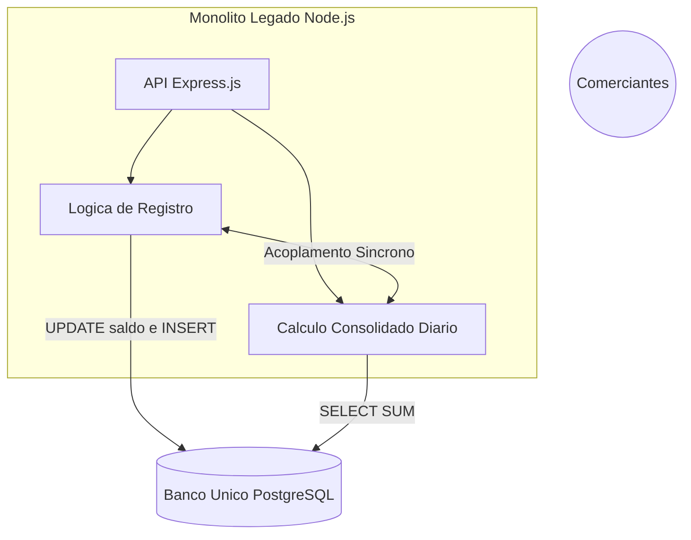
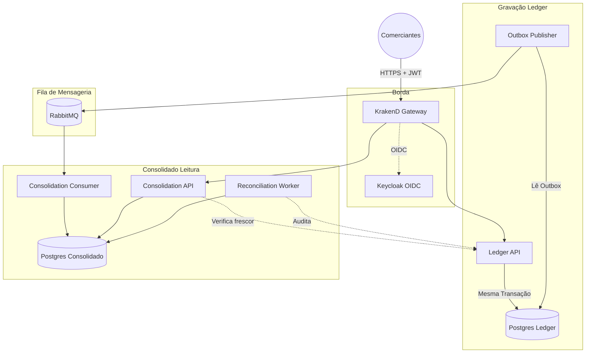
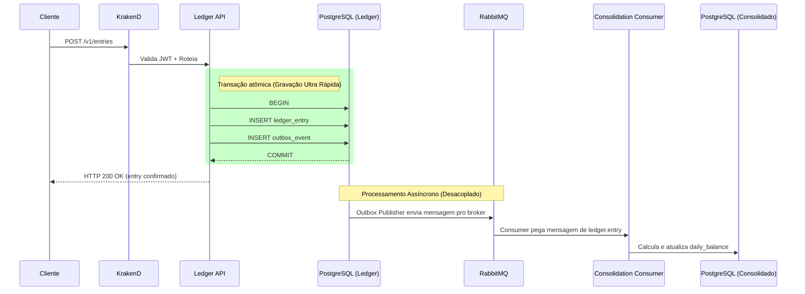
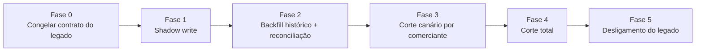
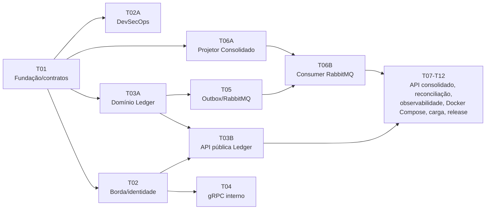

# Legado, Arquitetura Alvo e Migração

Este documento cobre, em ordem: o sistema legado e os incidentes reais que motivaram a reescrita, a arquitetura alvo e por que cada decisão foi tomada, o plano de migração do legado para o novo sistema, e a tabela de-para que liga cada decisão a um incidente real e à evidência de que a correção funciona.

## 1. O sistema legado

### 1.1 Macro arquitetura anterior (monolito Node.js)

O sistema anterior foi construído como uma aplicação monolítica utilizando Node.js (JavaScript puro, sem tipagem estrita), banco de dados relacional único e acoplamento forte entre operações de registro (Ledger) e cálculos (Consolidado Diário).

Características do legado:
- **Tecnologia:** Node.js (Express.js), JavaScript, ORM (Sequelize/TypeORM) mal otimizado.
- **Banco de Dados:** Banco único e compartilhado para gravação e relatórios analíticos.
- **Transações:** Longas e síncronas. Uma requisição de registro de lançamento realizava o cálculo do saldo do comerciante no exato momento da gravação.
- **Infraestrutura:** Apenas um único servidor (ponto único de falha), sem escalabilidade horizontal.
- **Segurança e Observabilidade:** Nenhuma camada de autorização formalizada e total "voo cego" (sem logs estruturados ou rastreamento de chamadas).

### 1.2 Cenários reais de falha e gargalos

Apesar do código ser funcional em ambiente de desenvolvimento (e ter passado em todos os testes locais), o comportamento em produção enfrentava falhas críticas sob concorrência e carga.

**Cenário 1 — Perda de chamadas por lock no banco de dados (deadlocks).** Durante horários de pico (fechamento de lojas às 18:00), milhares de comerciantes inseriam lançamentos de cartão de crédito e débito simultaneamente. A rota `POST /lancamentos` tentava inserir a entrada e, na mesma transação síncrona, o JS tentava fazer um `UPDATE saldos_diarios SET saldo = saldo + X WHERE comerciante = Y`. Múltiplas requisições simultâneas para o mesmo comerciante causavam row-level locks no banco, e o Node.js não lidava bem com retry nessas transações, estourando a capacidade do connection pool. Consequência real: o request do cliente caía em timeout (504), mas às vezes o *insert* havia funcionado e o *update* do saldo não, causando inconsistência irrecuperável entre o detalhamento e o saldo total.

**Cenário 2 — Timeouts no relatório consolidado (tabela enorme).** No começo do mês, os gestores precisavam consultar o consolidado dos últimos 30 dias. A rota `GET /relatorios/consolidado` executava `SELECT SUM(...) FROM lancamentos WHERE data BETWEEN ... GROUP BY data`. Como a tabela de lançamentos tinha centenas de milhões de linhas, o full table scan na base transacional (sem isolamento OLAP/OLTP) levava mais de 45 segundos. O Nginx na frente do Node.js fechava a conexão em 30 segundos, e o event loop do Node.js ficava enfileirando processamento I/O pesado, lentificando até quem só queria registrar uma venda simples de R$ 10,00.

**Cenário 3 — Ausência de idempotência.** O aplicativo móvel do cliente sofria instabilidade no 4G. O lojista tentava registrar uma venda, a requisição sofria lentidão (Cenário 1 ou 2), o aplicativo achava que tinha falhado e o lojista apertava "Tentar Novamente". A requisição chegava duas vezes no monolito e, como não havia `Idempotency-Key`, o JavaScript processava ambas as chamadas, duplicando a entrada financeira e o crédito no saldo do cliente.

**Cenário 4 — Vazamento de dados e voo cego.** A API rodava sem validação rígida de tokens ou autorização fina — um request alterando apenas o ID do cliente burlava a segurança (IDOR). Como havia apenas um servidor, se ele fosse derrubado (timeout ou ataque), todos os clientes ficavam offline. Sem logs estruturados ou tracing, um erro devolvia apenas HTTP 500, e o suporte precisava logar na única máquina via SSH e ler arquivos de texto espalhados para achar o problema. Consequência real: alto risco de compliance financeiro, vazamento de dados de concorrentes e um MTTR (tempo médio de recuperação) altíssimo.

## 2. Arquitetura alvo

### 2.1 Decisões e por quê

Analisando o cenário legado, identificamos que processar requisições pesadas de leitura de saldo no mesmo banco de dados responsável por gravar transações gerava os gargalos da seção 1 (locks de tabela e timeouts). A decisão foi usar CQRS (Command Query Responsibility Segregation) com bancos isolados, guiado a eventos (Go, gRPC, RabbitMQ), porque:

1. **Acaba com o lock compartilhado.** O Ledger só grava lançamentos rápidos. O Consolidado consome os eventos e calcula o saldo sem interferir na gravação.
2. **Idempotência nativa.** O envio exige a `Idempotency-Key`. Se a rede oscilar, o cliente pode reenviar a mesma chave e a API não cria o lançamento duas vezes.
3. **Fim dos timeouts.** O banco de Consolidação guarda a tabela do dia pré-calculada. O usuário consulta e recebe a resposta em milissegundos, sem somar histórico.
4. **Segurança no gateway.** O KrakenD fica na borda barrando qualquer request sem token JWT ou escopo válido antes de encostar na infraestrutura financeira.
5. **Observabilidade de ponta a ponta.** Todo o fluxo carrega o `trace_id` (OpenTelemetry) — dá pra buscar uma requisição desde a borda até o último consumidor sem precisar pescar logs.

### 2.2 Fluxo de funcionamento completo

A requisição chega no KrakenD e é validada. Em seguida, é direcionada para o contexto correto (Ledger ou Consolidation). Cada domínio roda em seu próprio banco PostgreSQL, e a sincronização é mediada pela fila no RabbitMQ.

### 2.3 Por que cada peça está separada

| Componente | A escolha técnica |
| --- | --- |
| **KrakenD & Keycloak** | Centraliza a segurança. Se a validação de token morasse dentro do Ledger, um bug de roteamento poderia virar uma falha de autorização financeira grave. |
| **Ledger API** | A única fonte de verdade para os lançamentos. Grava o evento de outbox junto com a transação para evitar a falha onde "gravou mas não avisou o resto do sistema". |
| **RabbitMQ** | Fila de transporte, com tolerância a falhas. A garantia financeira vem da transação do banco; o RabbitMQ apenas provê elasticidade e o tempo de esvaziamento das mensagens. |
| **Consolidation API** | Serve o saldo diário calculado previamente, nunca faz consultas matemáticas em tempo real cruzando a tabela histórica inteira. |
| **Bancos de dados isolados** | Cada serviço tem seu `schema` e sua `role` (`ledger_app` / `consolidation_app`), mitigando o risco de um domínio derrubar o outro. |

### 2.4 O caminho de um lançamento

O diagrama abaixo mostra o ponto principal: a gravação financeira é blindada e nunca aguarda a consolidação.

Isolando o problema dessa forma, entregamos respostas em milissegundos na gravação e asseguramos escalabilidade na leitura.

## 3. Migração do legado (Strangler Fig)

Trocar um sistema financeiro em produção de uma vez só é um risco grande demais — uma virada única é exatamente o tipo de indisponibilidade que este projeto quer eliminar. Por isso a transição segue o padrão Strangler Fig: o sistema novo cresce ao redor do legado e vai assumindo fatias de tráfego aos poucos, enquanto o legado continua sendo a fonte de verdade até o novo provar que chega no mesmo resultado.

**Fase 0 — congelar o contrato.** O monolito legado para de receber funcionalidade nova. O schema de `lancamentos`/`saldos_diarios` fica documentado como contrato de leitura para a fase de backfill. Nenhuma migração de dado começa antes disso, senão o alvo fica em movimento.

**Fase 1 — shadow write.** O KrakenD passa a espelhar cada `POST /lancamentos` também pra Ledger API nova, fora do caminho crítico do cliente (fire-and-forget). O legado continua sendo a única resposta que o cliente vê. O objetivo é provar, sob carga real, que a Ledger nova grava o mesmo resultado financeiro que o legado, sem risco, porque nada novo está sendo servido ainda. Rollback: desligar o espelhamento, zero impacto.

**Fase 2 — backfill histórico e reconciliação.** Um job em lote lê o histórico do banco único do legado (respeitando o contrato congelado na Fase 0) e replica para o schema `ledger` novo, guardando `entry_id`, data e valor originais como `original_entry_id`/posição. O Reconciliation Worker — que já é parte da arquitetura alvo (seção 2), não uma ferramenta descartável de migração — roda comparando contagem e soma do legado contra o Ledger novo, por comerciante e por dia. Só avança quem fechar em zero divergência. Rollback: o backfill é idempotente e pode ser refeito quantas vezes precisar, porque nenhuma escrita acontece no legado durante esse processo.

**Fase 3 — corte canário por comerciante.** O KrakenD passa a rotear a resposta de verdade pra stack nova, mas só para um grupo pequeno e reversível de comerciantes. O resto continua no legado. O shadow write da Fase 1 se inverte para esse grupo: é o legado que passa a receber a cópia assíncrona, só para garantir rollback instantâneo se precisar. Critério para promover mais comerciantes: nenhuma divergência de saldo, nenhum aumento de erro 5xx, e p95 dentro do SLO por um ciclo de fechamento diário completo. Rollback: voltar o roteamento do canário para o legado é só uma mudança de configuração no KrakenD, não uma migração de dado.

**Fase 4 — corte total.** Com o canário estável, o roteamento migra 100% dos comerciantes para a stack nova. O legado para de receber escrita nova, mas continua de pé, só leitura, como fonte de auditoria e plano de contingência imediato. Rollback: ainda dá para reverter o roteamento do KrakenD para o legado enquanto ele estiver de pé — última fase em que o rollback ainda é barato.

**Fase 5 — reconciliação contínua e desligamento.** Depois de um período de estabilização sem divergência (um ciclo de fechamento contábil completo), o legado é desligado. A partir daqui a "reconciliação de migração" simplesmente vira a reconciliação operacional que já estava prevista na arquitetura alvo — não é descartada, é o mesmo componente continuando o trabalho.

### Por que essa estratégia e não outra

| Alternativa considerada | Por que foi descartada |
| --- | --- |
| Big bang (trocar tudo num fim de semana) | Repete o próprio risco que motivou a reescrita: qualquer inconsistência de saldo só aparece depois que já afetou o cliente. |
| Dual-write permanente, sem nunca desligar o legado | Mantém o domínio de falha do legado (servidor único, sem idempotência) como uma dependência que nunca termina. |
| Migrar o dado primeiro e o código depois | Sem a Ledger nova já validada pelo shadow write, o backfill não teria como provar paridade antes do corte. |

## 4. De-para de decisões e verificação

### 4.1 De cada incidente à correção

| Problema real do legado | O que a arquitetura nova faz | Onde isso está provado neste repositório |
| --- | --- | --- |
| Cenário 1: deadlock de `UPDATE` concorrente no mesmo comerciante | O Ledger é append-only. O saldo é recomputado depois, de forma assíncrona, nunca na mesma transação da escrita. | Transação única grava entry, idempotência, posição e outbox junto. Teste de concorrência real no domínio do Ledger. |
| Cenário 2: `SELECT SUM` de 45 segundos numa tabela histórica | O read model (`daily_balance`) já vem pré-calculado, atualizado por evento. A leitura nunca soma o histórico inteiro. | Consolidation API e o projetor materializam o saldo por dia. Testes reais com PostgreSQL mostram consulta imediata. |
| Cenário 3: sem `Idempotency-Key`, saldo duplicava | A chave é obrigatória no contrato Protobuf/HTTP e a unicidade vem de `idempotency_record`, gravado na mesma transação do lançamento. | Cenários BDD de duplicidade (`impedir-duplicidade-lancamentos.feature`) e testes reais de retry/duplicata no outbox. |
| Cenário 4: IDOR e falta de autenticação | O `merchant_id` vem só do JWT validado (Keycloak, KrakenD e uma checagem no serviço). Nunca é aceito do payload. | Testes reais com token ausente, expirado, com assinatura inválida ou sem escopo, todos rejeitados sem tocar em nenhum dado, provando que a borda nem encaminha a chamada. |
| Cenário 4: servidor único, ponto único de falha | Cada serviço roda com várias réplicas atrás de balanceamento. Uma queda do Consolidado ou do RabbitMQ não afeta o Ledger. | Teste que derruba o Consolidado de propósito e mostra os lançamentos continuando a ser confirmados durante a queda. |
| Cenário 4: sem log nem tracing | OpenTelemetry cobre tudo de ponta a ponta (`traceparent` obrigatório no evento AMQP). Logs estruturados sem nenhum dado sensível. | Coletor OTLP real inspecionado nos testes, provando que JWT, valor e descrição não aparecem em log nem em trace. |

Cada decisão técnica vem de um incidente real do sistema anterior (seção 1), não de uma preferência por microsserviços porque sim.

### 4.2 Como isso foi construído, e como se verifica que funciona

Esta seção documenta como cada componente foi verificado na prática, não apenas descrito.

**A regra que sustenta o processo: nenhuma correção é aceita pela própria palavra de quem a implementou.** Todo ticket do diagrama acima passa pelo mesmo funil antes de ser integrado: primeiro a implementação, depois os gates reais (build, `go vet`, testes com `-race`, PostgreSQL/RabbitMQ/Keycloak/KrakenD de verdade, segurança, SBOM), e só então uma revisão focal feita por um agente independente, sem o contexto de quem implementou. Nenhum cenário de BDD é aceito por um contador genérico ou uma lista de string — o oráculo tem que observar um efeito real: uma linha no banco, uma mensagem no broker, uma resposta HTTP.

Esse processo já encontrou, e corrigiu, os seguintes problemas antes deles chegarem perto de produção:

| Onde | O que a revisão independente encontrou | Impacto da correção |
| --- | --- | --- |
| Borda (T02), primeira rodada | O PKCE quebrava porque o timeout do gateway (5s) era menor que o orçamento real do fluxo OIDC (15s). | Teste de integração real pegando um problema que só aparece sob timeout de produção, nunca num unit test. |
| Borda (T02), rodadas 2 e 3 | A evidência de BDD estava "superdeclarada": o binding só conferia uma lista de string, não o comportamento literal do cenário. E dado sensível vazava pelo `tracestate` do trace context. | "Os testes passam" não é a mesma coisa que "o comportamento está correto", e essa diferença é verificável. |
| Borda (T02), quarta rodada | Mesmo depois de "corrigido", o healthcheck novo ainda expunha `/__health` na porta pública. A evidência ainda podia ser fabricada recalculando o próprio checksum. O oráculo de "sem encaminhamento indevido" só olhava um contador pós-autenticação, não a entrada real. O critério de anti-enumeração aceitava uma diferença de tempo de 2x, perfeitamente distinguível. | Cada correção foi verificada de novo, do zero — nenhuma suposição de que uma correção anterior continuava válida. |
| Borda (T02), quinta rodada | A correção anterior (assinar a evidência com HMAC) vazava a própria chave pelo eco padrão do `make`, em qualquer log de CI. Dava para pegar essa chave e re-assinar uma evidência antiga sem rodar nada de verdade. | O bug mais sutil da série: a correção de um problema de segurança abriu, no mesmo commit, o canal para reabrir esse mesmo problema. Só apareceu porque a revisão reproduziu o ataque de ponta a ponta. |
| Outbox/RabbitMQ (T05) | A fila usava dead-lettering `at-most-once`, que podia perder mensagem antes dela chegar na DLQ. Um fixup posterior quebraria o deploy em cima da fila que já existia em produção. Um teste de queda da DLQ tinha um panic sem tratamento que deixava container vazando. | Prova de disciplina no rollout: nenhuma correção foi aceita até provar uma migração segura em cima do estado que já existia, não só num ambiente vazio. |

**O que isso demonstra:** zero perda financeira não é um slogan — é testado derrubando o RabbitMQ e o Consolidado de propósito enquanto os lançamentos continuam sendo confirmados, e depois provando que 100% deles foram aplicados exatamente uma vez. Segurança foi tratada como código, não como checklist marcado uma vez só: foram cinco rodadas de correção só na borda, cada uma achando um bypass novo e mais sutil que o anterior, até fechar de verdade. A própria evidência de teste foi tratada como uma superfície de ataque — o processo desconfiou até da prova de que os testes passaram, e isso pegou um bug real que passaria despercebido numa auditoria superficial.
