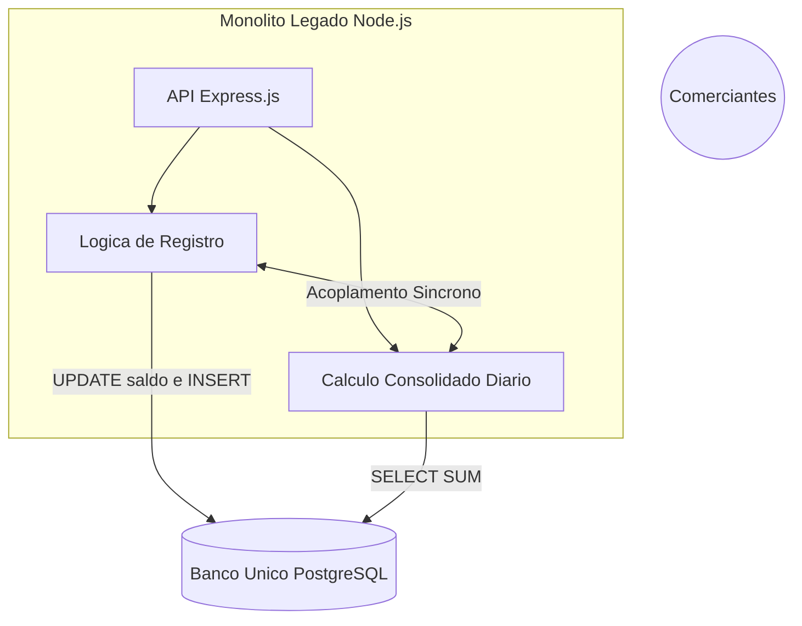

# O Legado e os Incidentes Reais

Este documento descreve a macro arquitetura do sistema legado de Fluxo de Caixa (anterior à versão T01/CQRS) e os cenários reais de falha que levaram à reescrita do projeto. Faz sentido começar por aqui: sem entender o que quebrava antes, as decisões da [arquitetura alvo](arquitetura-alvo.md) parecem só uma preferência estética por microsserviços, e não a correção de um problema concreto.

## 1. A Macro Arquitetura Anterior (Monolito JS)

O sistema anterior foi construído como uma aplicação monolítica utilizando Node.js (JavaScript puro, sem tipagem estrita), banco de dados relacional único e acoplamento forte entre operações de registro (Ledger) e cálculos (Consolidado Diário).

### Características do Legado:
- **Tecnologia:** Node.js (Express.js), JavaScript, ORM (Sequelize/TypeORM) mal otimizado.
- **Banco de Dados:** Banco único e compartilhado para gravação e relatórios analíticos.
- **Transações:** Longas e síncronas. Uma requisição de registro de lançamento realizava o cálculo do saldo do comerciante no exato momento da gravação.
- **Infraestrutura:** Apenas **um único servidor** (Single Point of Failure), sem escalabilidade horizontal.
- **Segurança e Observabilidade:** Nenhuma camada de autorização formalizada e total "voo cego" (sem logs estruturados ou rastreamento de chamadas).

---

## 2. Cenários Reais de Falha e Gargalos

Apesar do código ser funcional em ambiente de desenvolvimento (e ter passado em todos os testes locais), o comportamento em produção enfrentava falhas críticas sob concorrência e carga.

### Cenário 1: Perda de Chamadas por Lock no Banco de Dados (Deadlocks)
**Situação:** Durante horários de pico (fechamento de lojas às 18:00), milhares de comerciantes inseriam lançamentos de cartão de crédito e débito simultaneamente.
**Falha:**
1. A rota `POST /lancamentos` tentava inserir a entrada.
2. Na mesma transação (síncrona), o JS tentava fazer um `UPDATE saldos_diarios SET saldo = saldo + X WHERE comerciante = Y`.
3. Múltiplas requisições simultâneas para o mesmo comerciante causavam **Row Level Locks** no banco de dados.
4. O Node.js não lidava bem com retry nessas transações e estourava a capacidade do connection pool.
**Consequência Real:** O request do cliente caía em Timeout (Gateway Timeout 504), mas algumas vezes o *insert* no banco havia funcionado e o *update* do saldo não, causando inconsistência irrecuperável entre o detalhamento e o saldo total.

### Cenário 2: Timeouts no Relatório Consolidado (Tabela Enorme)
**Situação:** No começo do mês, os gestores precisavam consultar os consolidado de resultados dos últimos 30 dias.
**Falha:**
1. A rota `GET /relatorios/consolidado` executava uma query `SELECT SUM(...) FROM lancamentos WHERE data BETWEEN ... GROUP BY data`.
2. Como a tabela de lançamentos tinha centenas de milhões de linhas, o *Full Table Scan* na base transacional (sem isolamento OLAP/OLTP) levava mais de 45 segundos.
3. O Nginx na frente do Node.js fechava a conexão em 30 segundos (504 Gateway Timeout).
4. Pior: O Event Loop do Node.js ficava enfileirando processamento I/O pesado, lentificando até mesmo quem só queria registrar uma venda simples de R$ 10,00.
**Consequência Real:** Sistema "cai", usuários frustrados, e o suporte não conseguia provar os saldos corretos pois cada nova tentativa travava mais o banco.

### Cenário 3: Ausência de Idempotência
**Situação:** O aplicativo móvel do cliente sofria instabilidade no 4G.
**Falha:**
1. O lojista tenta registrar uma venda, a requisição sofre lentidão (Cenário 1 ou 2).
2. O aplicativo acha que falhou e o lojista aperta "Tentar Novamente".
3. A requisição chega duas vezes no Monolito Node.js.
4. Como não havia chave de idempotência (`Idempotency-Key`), o JavaScript processava ambas as chamadas, duplicando a entrada financeira e o crédito no saldo do cliente.

### Cenário 4: Vazamento de Dados e Voo Cego (Falta de Auth e Observabilidade)
**Situação:** Em uma auditoria, percebe-se que é possível ver dados de terceiros e ninguém consegue debugar logs lentos.
**Falha:**
1. A API Node.js rodava sem validação rígida de tokens ou autorização fina. Um request alterando apenas o ID do cliente burlava a segurança (IDOR - Insecure Direct Object Reference).
2. Como havia apenas **um servidor**, se ele fosse derrubado (seja por timeout ou ataque), todos os clientes ficavam offline.
3. Sem sistema de Logs (ELK, Datadog) ou tracing, um erro devolvia apenas HTTP 500. O suporte precisava logar na única máquina via SSH e ler arquivos `text` espalhados para achar o problema.
**Consequência Real:** Altíssimo risco de compliance financeiro, vazamento de dados de concorrentes e um MTTR (Mean Time to Recovery) absurdo pois ninguém encontrava a raiz do erro.

---

Próximo: [Arquitetura Alvo, com justificativa, diagrama completo e o caminho de uma requisição](arquitetura-alvo.md).
