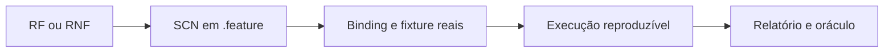

# Estratégia de testes e evidências

## Objetivo e fonte oficial

Esta estratégia explica como verificar a solução sem copiar os Gherkins. Os 81 cenários aprovados vivem exclusivamente nos 14 arquivos de [`features/`](../features/); nome, regra e exemplos devem ser consultados ali. A [matriz de rastreabilidade](testing-traceability.md) liga RF/RNF, tags `@SCN-*`, nível de teste e evidência esperada.

Um cenário declarado não prova uma implementação. A cadeia mínima de evidência é:



## Vocabulário de status

| Estado | Significado operacional |
|---|---|
| Aprovado | O cenário possui tag única e passa pelo parser; ainda pode não ter binding. |
| Pendente de implementação | A tag não está em `features/implemented_scenarios.txt`; o cenário é catalogado, mas excluído da suíte comportamental. |
| Implementado | A tag está no manifesto e possui binding real, fixture e asserção contra o sistema. |
| Verificado | O cenário implementado passou no ambiente exigido e publicou a evidência definida nesta estratégia. |

No estado atual existem **81 aprovados, 71 pendentes de implementação e 10 tags T02 implementadas/verificadas pelo runtime de segurança**.

## Níveis de teste

| Nível | Finalidade | Escopo típico | Ferramenta/evidência |
|---|---|---|---|
| Catálogo e sintaxe | Impedir drift, tags ausentes/duplicadas e Gherkin inválido | Todos os 81 cenários | parser Gherkin, Godog parser, `bdd-catalog.json` |
| Unitário | Provar regras puras e invariantes rapidamente | dinheiro, datas/fusos, idempotência, posições, transições de estado | `go test`, tabela de casos, cobertura |
| Contrato | Provar compatibilidade na borda e integrações | Protobuf/gRPC, OpenAPI, evento AMQP | testes de contrato, Buf, descriptors e schemas versionados |
| Integração de componente | Provar serviço + dependências reais | Ledger/PostgreSQL, consumer/PostgreSQL, Redis, RabbitMQ | Go + Testcontainers, relatório de teste e logs da fixture |
| BDD executável | Provar comportamento observável por cenário aprovado | Tags adicionadas ao manifesto | Godog via `go test`, relatório por `@SCN-*` |
| E2E/fitness | Provar fronteiras, segurança e falhas entre componentes | gateway, OIDC, gRPC, outbox, DLQ, reconciliação, observabilidade | Compose/Testcontainers, traces, métricas e relatório de falha |
| Desempenho | Provar o perfil sustentado do consolidado | `@SCN-RNF03-001` | k6, summary versionado e massa conhecida |

Unitários não substituem BDDs; BDDs não substituem contratos, falhas reais ou carga. Um requisito crítico é verificado pelo menor conjunto de níveis que prova sua regra e sua integração.

## Como o Godog funciona neste repositório

### Inventário sempre validado

`internal/bddcatalog` parseia cada `.feature`, exige `# language: pt` na primeira linha, uma `Funcionalidade`, exatamente uma tag `@SCN-*` por cenário, 81 tags únicas e um manifesto válido. `make bdd-parse` executa essa validação.

O catálogo é intencionalmente plano nesta versão. Se encontrar `Regra:`, rejeita o arquivo com erro preciso em vez de ignorar silenciosamente cenários aninhados.

`TestAllFeaturesParseWithGodog` também força o Godog a carregar os arquivos. Ele usa uma tag que não seleciona cenários: valida parsing, não steps nem comportamento.

`TestGodogDiscoveryMatchesCatalog` reconcilia as 81 tags nos dois sentidos e exige 95 pickles: 81 cenários declarados menos 6 outlines, mais as 20 linhas de exemplos. “81 cenários” identifica requisitos; “95 execuções” identifica os casos expandidos pelo runner.

### Seleção de cenários implementados

`features/implemented_scenarios.txt` é a allowlist. Uma tag só deve entrar junto com:

1. binding específico registrado no `ScenarioContext`;
2. fixture isolada e determinística;
3. chamada ao componente real no nível exigido;
4. asserção do oráculo do cenário;
5. evidência gerada pelo teste.

Cenários ausentes do manifesto não são chamados de `skip` pelo Godog; simplesmente não são selecionados para execução comportamental. Isso mantém a diferença entre “requisito aprovado” e “comportamento entregue”.

Quando selecionado, um cenário com step `undefined`, `pending`, `ambiguous` ou `skipped` deve reprovar. `godog.ErrPending`, `godog.ErrSkip`, `testing.T.Skip*` e handlers vazios não são uma forma válida de avançar o manifesto.

O Godog v0.15.1 usa filtro Behat legado. Múltiplas tags do manifesto são unidas por vírgula (`@A,@B`) para representar OR; palavras como `or` e parênteses viram parte de uma tag literal. Um teste de política executa duas tags e protege essa compatibilidade.

O `bddguard` analisa todos os arquivos do mesmo package e exige que cada registro aponte diretamente para uma função local, um método local de nome unívoco ou uma função inline não trivial. Se o corpo não puder ser resolvido, falha fechado com `cannot be resolved within its package`. Selector de package importado é reconhecido antes da busca de métodos locais, evitando aprovação por colisão de nome.

Esta análise AST deliberadamente não usa tipos: métodos homônimos em receptores diferentes e factories como `makeHandler(dep)` são rejeitados. Steps dos próximos tickets devem usar nomes unívocos e referências diretas; suportar esses padrões exige evolução posterior com análise de tipos, fora do T01.

### Estado atual do wiring

O manifesto liga 10 tags T02 a `TestImplementedScenarios`, `test/bdd/steps.Initialize`, `internal/bddrunner.Run` e `internal/bddguard`. Os bindings exigem evidência estruturada produzida pelo E2E real com Keycloak, KrakenD, imagens finais das APIs e Collector; execução Godog isolada dispara esse runtime antes dos cenários.

Consequências práticas:

- o `PASS` atual prova catálogo, parsing, reconciliação e os 10 oráculos T02 contra runtime real;
- adicionar uma tag ao manifesto sem binding real fará o runner reprovar por step indefinido;
- fixtures automatizadas continuam provando que tag sem binding, manifesto/tag inválida, undefined, pending, skip e handler vazio falham;
- não existe filtro local para executar uma única tag implementada; a suíte usa o manifesto inteiro.

A ausência de filtro ad hoc é uma limitação de ergonomia, não um bypass: a allowlist versionada continua sendo a seleção oficial. As tags atuais provam somente identidade, gateway, transporte gRPC e telemetria do T02, nunca regras financeiras.

## Comandos locais

| Objetivo | Comando | Critério de sucesso atual |
|---|---|---|
| Validar catálogo | `make bdd-parse` | `validated 14 features, 81 unique scenarios, 0 implemented` enquanto o manifesto estiver vazio |
| Testar harness BDD | `go test -race ./test/bdd/...` | parser, catálogo, inventário Godog, guards e fixtures positivas/negativas verdes; zero implementados não significa comportamento verificado |
| Rodar a suíte implementada | `go test -race ./test/bdd -run '^TestImplementedScenarios$' -v` | todos os cenários do manifesto passam; atualmente o runner comprova que a seleção vazia é rejeitada sem executar comportamento |
| Rodar todos os testes Go | `go test -race ./...` | todos os pacotes verdes; pode depender de gerados/recortes ainda em construção |
| Rodar gates do repositório | `make ci` | geração, formato, contratos, build, testes e catálogo verdes |
| Gerar relatórios básicos | `make reports` | `evidence/reports/go-test.json` e `bdd-catalog.json` produzidos localmente; ambos são ignorados pelo Git |

Não edite o manifesto apenas para selecionar temporariamente um cenário. Até existir um filtro explícito, a seleção oficial é versionada e representa compromisso de implementação.

## Execução no CI

O workflow `.github/workflows/ci.yml` executa `make ci`, chama `make reports` mesmo após falha e publica `evidence/reports/` no artefato `foundation-reports`. `bdd-catalog.json` e `go-test.json` são gerados por esse fluxo e por `make reports`; como são ignorados pelo Git, um clone limpo contém apenas `.gitkeep` até o comando ser executado.

O gate de BDD deve distinguir:

1. **catálogo:** todos os 81 continuam válidos e únicos;
2. **implementados:** todas as tags do manifesto foram realmente executadas;
3. **qualidade de execução:** nenhum status indefinido, pendente, ambíguo ou pulado;
4. **evidência especializada:** k6, falha, reconciliação, segurança e observabilidade são anexados quando exigidos.

Os relatórios atuais não incluem resultado Cucumber/JUnit por tag nem summary k6. São evidências futuras necessárias, não arquivos já entregues.

## Critérios gerais de sucesso

- Cada cenário executado é isolado: independe da ordem e limpa sua massa.
- Relógio, fuso, comerciante, IDs e cortes são controlados pela fixture.
- Valores financeiros são comparados de forma exata, sem ponto flutuante.
- Concorrência usa barreira de início e confirma contagem/efeito final, não somente códigos HTTP.
- Falhas são injetadas numa janela conhecida e registram instante inicial, recuperação e corte de reconciliação.
- Uma resposta só é sucesso se cumprir código, contrato e oráculo de negócio.
- Todo relatório identifica commit, ambiente, versões, massa, tags executadas e resultado.
- Até 5% de falhas no pico significa perda de atendimento; perda de lançamento financeiro confirmado continua sendo zero.

## Evidência esperada por capacidade crítica

| Capacidade | Cenários de referência | Critério de sucesso | Evidência mínima |
|---|---|---|---|
| Resiliência e zero perda | `@SCN-RNF01-001..004`, `@SCN-RNF02-001..002`, `@SCN-RNF07-005`, `@SCN-RNF08-001` | em `@SCN-RNF02-001`, 6.000 lançamentos são confirmados a 50/s durante 2 min de queda; após dependências ficarem `Ready`, backlog e DLQ relacionados zeram e a reconciliação converge em até 5 min, com zero ausentes, extras e duplicados | lista/hash dos IDs confirmados, somatórios por comerciante/data, timestamps da falha e do `Ready`, estado da outbox, backlog/DLQ, relatório de reconciliação e logs do fault injection |
| Idempotência | `@SCN-RNF05-001..004`, `@SCN-RF03-003..006`, `@SCN-RF04A-002`, `@SCN-RNF06-004..005` | mesma chave/conteúdo recupera o mesmo ID; conflito não altera o original; concorrência gera um efeito; a mesma chave permanece isolada entre comerciantes | respostas correlacionadas, IDs, contagem na Ledger/outbox/read model e saldo final por comerciante |
| DLQ e reconciliação | `@SCN-RNF04-*`, `@SCN-RF05-006`, `@SCN-RNF06-006`, `@SCN-RNF07-003` | item isolado não some; dias afetados ficam atrasados; reprocessamento aplica exatamente uma vez; backlog/DLQ zeram antes do alerta fechar | profundidade/idade da DLQ, estados por dia, posições antes/depois, valores reconciliados, registro do corte e ciclo do alerta |
| Multi-tenant | `@SCN-RNF06-001..007`, com anti-enumeração em `@SCN-RF02-006` | identidade define o comerciante; mesma chave é isolada; eventos, saldos, posições e falhas de A não alteram B; acesso horizontal não revela existência | tokens/claims de teste, respostas anti-enumeração, IDs por comerciante, saldos/posições antes/depois e análise estatística quando aplicável |
| Retroatividade | `@SCN-RF01-002..005`, `@SCN-RF04-005`, `@SCN-RF04A-003`, `@SCN-RNF06-006` | D-30 aceito, D-31/futuro rejeitados; fuso não reclassifica histórico; dia e acumulados posteriores são recompostos | relógio/fuso fixos, respostas da Ledger, snapshots antes/depois, posições e oráculo numérico multi-dia |
| Carga do consolidado | `@SCN-RNF03-001` | 15.000 chegadas em taxa aberta de 50 RPS/5 min; ≥14.250 respostas 2xx corretas em ≤1 s; p95 calculado sobre todas as respostas concluídas ≤500 ms | script/config k6, hash da massa, ambiente, summary bruto e legível, taxa efetiva, checks de saldo, p95/p99, timeouts, erros e dropped iterations |

Para carga, a evidência deve declarar explicitamente o denominador de 15.000 chegadas e calcular o p95 sobre todas as respostas concluídas. Pelo menos 14.250 respostas precisam ser HTTP 2xx, corretas e concluídas em até 1 segundo. Iteração não iniciada, descartada, resposta incorreta ou timeout não conta como sucesso. O teste de leitura não prova sozinho zero perda financeira; esse invariante vem dos cenários de resiliência e reconciliação.

## Organização esperada das evidências

Sem impor ainda um script de CI, os relatórios devem convergir para uma estrutura navegável:

```text
evidence/reports/
  bdd-catalog.json          # gerado por make reports/CI; ignorado no clone
  go-test.json              # gerado por make reports/CI; ignorado no clone
  godog/                    # resultado por SCN, ainda ausente
  resilience/               # fault injection e reconciliação, ainda ausente
  k6/                       # summary e configuração de carga, ainda ausente
  security-observability/   # traces, métricas e alertas, ainda ausente
```

Arquivos gerados não substituem uma síntese curta com ambiente, commit, decisão de aceite e links para os dados brutos.

## Lacunas documentadas

- 0/81 cenários têm bindings de negócio declarados no manifesto.
- Não há execução seletiva local por uma única `@SCN-*` sem alterar o manifesto.
- Não há relatório Godog Cucumber/JUnit por tag.
- Não há script/configuração k6 nem relatório do pico.
- Não há evidências produzidas de Testcontainers, fault injection, DLQ, reconciliação, multi-tenant ou observabilidade.
- `make reports` produz apenas catálogo e saída JSON do `go test`; esses arquivos são transitórios, ignorados pelo Git e publicados pelo CI.

Essas lacunas impedem marcar os cenários como verificados, mas não invalidam o catálogo aprovado.
